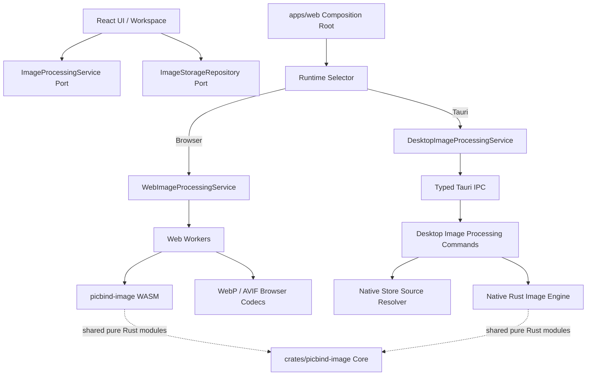

# PicBind Image Processing API V1

> 文档状态：V1 Port、Web Adapter、UI 迁移和 Desktop Native capability 切换已完成；共享 Rust Core 提取与 macOS x86_64 补测仍为后续项
> 适用范围：Web 与 Tauri Desktop 的图片检查、参数预览、最终物化、压缩、转换和协作派生资源
> 最后校对：2026-08-27

## 1. 文档目的

PicBind 的 Web 和 Desktop 复用同一套 React UI，但两端不应被迫使用同一套图片执行
算法：

- Web 继续使用 Web Worker、Rust WASM、浏览器解码能力以及 WebP / AVIF 浏览器编码器。
- Desktop 使用 Tauri 调用 Native Rust 图片引擎，并优先直接处理 Native Store 中的文件。
- UI、Workspace 和协作逻辑只依赖稳定的业务接口，不直接导入 WASM、Worker 或 Tauri
  `invoke`。

本文档定义 V1 接口、平台边界、数据传输、行为一致性和迁移顺序。它不修改当前压缩
算法；实际压缩规则仍以
`docs/product/collaboration/COMPRESSION_ALGORITHM.md` 为准。

## 2. 结论摘要

V1 采用以下设计：

1. 对外接口命名为 `ImageProcessingService`，与已有 `ImageStorageRepository` 分离。
2. Web 与 Desktop 共享请求、参数文档、结果、错误和能力模型，但各自拥有独立 Adapter。
3. 应用组合根只判断一次运行环境，`packages/ui` 不直接判断 Tauri，也不反向导入
   `apps/web`。
4. 协作编辑继续使用“一个不可变源图 + 一个有序参数文档”的延迟物化模型。
5. 参数预览与参数提交不得触发全尺寸编码；只有保存、另存、覆盖、导出或下载才物化。
6. 压缩和格式转换是独立的全尺寸任务，不写入协作参数文档。
7. 输入和输出同时支持短生命周期 `Blob` 与受控 `ImageAssetReference`，不把绝对路径暴露
   给 UI，也不强制 Desktop 通过 IPC 传输整张图片。
8. 两端不要求生成逐字节相同的文件；必须满足相同的格式、Alpha、尺寸、源图不可变、
   取消和质量护栏语义。
9. Desktop 功能不允许在 Native 执行失败后静默回退到 Web 算法。Native capability 以外的
   输入或参数文档只能由显式组合层在调用前路由，并在结果中保留实际 `engine`。

## 3. 当前实现基线

### 3.1 当前调用链

当前 UI 已统一通过 `ImageProcessingProvider` 获取 `ImageProcessingService`，平台选择只发生在
`apps/web/src/image-processing/create-image-processing-service.ts`。实际执行边界如下：

| 能力 | Web 当前实现 | Desktop 当前实现 |
| --- | --- | --- |
| 首页压缩 | Web Adapter 调用 Worker、WASM 和浏览器 WebP / AVIF 编码器 | JPEG、PNG、WebP、AVIF 由 Native Planner / Encoder 执行 |
| Room / Workspace 压缩与转换 | Web Adapter 保留既有 `interactive` 链路 | 四格式输入、固定格式与 `auto`、可选 resize 均走 Native Rust |
| 参数实时预览 | Web Adapter 使用受限 Canvas / OffscreenCanvas | 受支持格式和参数操作使用 Native Rust 生成受限 WebP 预览 |
| 最终参数重放 | Web Adapter 从不可变源图重放完整文档 | 受支持格式和参数操作由 Native Rust 全尺寸重放并一次编码 |
| Metadata 与质量分析 | Web Adapter 调用 WASM / Analysis Worker | 四格式输入使用 Native Rust 分析与双图质量比较 |
| placeholder / thumbnail | Web Adapter 调用现有 WASM 派生能力 | Native Rust 生成主色、BlurHash 和独立 WebP thumbnail |
| 图片存储 | Dexie + OPFS Repository | Tauri IPC + SQLite + Native Files；Native codec 可直接解析受控存储引用 |

Desktop 不是无条件禁用 Web Adapter。`DesktopImageProcessingSelector` 只把 JPEG、PNG、WebP、
AVIF 和 `crop`、`resize`、`rotate`、`color`、`draw` 路由到 Native；GIF 等兼容输入以及
`filter`、`annotation`、`ai` 参数文档在 `destination: "memory"` 时显式走 Web Adapter。
需要 `temporary` 输出但不属于 Native capability 的请求返回 `capabilityUnavailable`。一旦
任务已选择 Native，执行失败后不会再用 Web 重试。

### 3.2 当前 Rust 边界

- `crates/picbind-core` 保存 Workspace、协作和图片领域状态，不是像素算法 crate。
- `crates/picbind-image` 承担图片分析、压缩、格式处理、metadata、缩略图和 placeholder，
  但公开入口目前带有 `wasm_bindgen`、`JsValue` 和 `js_sys` 类型。
- `crates/picbind-image-native` 是不依赖 Tauri、WASM 或 UI 类型的 Native codec，已实现
  JPEG、PNG、WebP、AVIF 的统一解码与 4×4 编码矩阵。
- `apps/desktop/src-tauri/src/image_processing` 已提供受控来源解析和二进制图片处理命令。
- WebP / AVIF 的部分 Web 编码能力位于 `packages/wasm/image-codecs`，不是纯 Rust Core。

当前 Web 与 Desktop 使用不同 Rust codec：Web 保留现有 WASM PCE；Desktop 对四种受支持
格式使用 Native codec 执行 metadata、`interactive` / `planner` 压缩、`auto`、转换、参数
预览、最终物化、派生资源和质量分析。受支持参数的纯 Rust 重放 Core 已实现并接入 Native
Adapter。Web PCE 中可复用的 Planner 与参数重放模块尚未提取到双方共享 Core，这不影响
Desktop 当前调用 Native Rust，但意味着阶段 4 的代码共享重构仍未全部完成。

## 4. 目标与非目标

### 4.1 目标

- UI 只依赖 `ImageProcessingService`。
- 参数预览、最终物化、压缩、转换、metadata 和协作派生资源具有稳定契约。
- Web 与 Desktop 可以使用不同解码器、编码器、并发模型和缓存策略。
- Desktop 可以根据受控存储引用直接读取和写入文件，避免无意义的大 Blob IPC 往返。
- 所有长任务支持取消、阶段进度、稳定错误码和资源释放。
- 处理结果明确记录实际执行引擎，便于诊断和回归比较。
- 平台能力可以被检测，未实现功能不能伪装成成功。

### 4.2 非目标

- V1 不要求 Web 与 Desktop 输出文件的哈希或字节完全一致。
- V1 不把数据库、文件系统或缓存治理合并进图片处理接口。
- V1 不允许 UI 传入任意本机绝对路径。
- V1 不新增云端图片处理、上传或 Worker 代理编码。
- V1 不重新定义 Workspace Commit、Proposal 或 realtime 协议。
- V1 不改变现有压缩质量、同格式不增大和 Alpha 保护规则。
- V1 不承诺 AI、动画图片、多帧导出或 HDR 已受支持。

## 5. V1 架构



核心原则：

> 共享的是业务语义和可复用的纯 Rust 模块，不是平台绑定层，也不是输出字节。

图中的共享 Rust Core 虚线表示允许的提取方向；当前 Web PCE 与 Native codec 尚未完成该部分
合并，实际运行时不会在两端之间跨引擎调用。

### 5.1 Web 与 Desktop 当前执行差异

下表描述当前 V1 执行方式。Desktop Native 已实现表内能力；具体格式、参数操作和显式 Web
兼容路由以第 3 节及运行时 `capabilities()` 为准。

| 环节 | Web Adapter | Desktop Native Adapter | 必须共享的语义 |
| --- | --- | --- | --- |
| 输入解析 | 从 `Blob` 或 Web Storage Repository 读取 | Rust 直接解析 Native Store 引用；未落盘 Blob 使用原始二进制 IPC | 不接受任意绝对路径，处理期间源资产不可变 |
| 解码与 metadata | 浏览器解码能力与 `picbind-image` WASM | Native Rust 解码器 | 方向修正、尺寸、格式和 Alpha 判定语义一致 |
| 参数预览 | 受限尺寸 Canvas / OffscreenCanvas，必要时使用 WASM | 受限尺寸 Native 缓冲区，通过临时产物或小型二进制结果交给 WebView | 使用同一参数文档和操作顺序，不执行全尺寸压缩 Planner |
| 最终物化 | 从源 Blob 全尺寸重放参数，再由 Web 编码器输出 | Rust 直接从 Native Store 源文件全尺寸重放参数并写受控输出 | 只在保存、覆盖、导出或下载时编码 |
| JPEG / PNG 压缩 | 现有 Worker、WASM Planner 和编码器 | Native Rust Planner 和编码器 | Alpha、质量护栏、候选失败隔离和同格式不增大规则一致 |
| WebP / AVIF 压缩 | 当前浏览器 codec 与 Worker 编排 | 可使用不同 Native codec、线程数和 effort | 输出格式与质量护栏一致，不要求字节或大小一致 |
| placeholder / thumbnail | 当前 WASM 派生能力 | Native Rust 派生能力 | placeholder 与 thumbnail 分开生成，realtime 限制一致 |
| 大结果交付 | 通常返回 `Blob`，由 Web Repository 决定持久化 | 返回临时 token 或直接写入受控存储，禁止 Base64 / JSON 字节数组 | UI 不接触本机路径，调用方决定最终业务位置 |
| 并发与取消 | 有界 Worker 池、`AbortSignal`、终止 Worker | Rust 任务表、取消标记、Tauri cancel command | 使用同一 `requestId`、进度阶段和 `cancelled` 错误码 |

这一区分意味着，接口抽取不能只是把现有 Web 函数改名后在 Desktop WebView 中继续调用。
Web Adapter 可以包装当前实现，Desktop Adapter 必须在对应 Native capability 完成后才声明
支持；两端通过契约测试保证产品行为一致。

## 6. 分层职责

| 层 | 职责 | 禁止事项 |
| --- | --- | --- |
| React UI / Workspace | 收集参数、展示进度和结果、决定保存动作 | 不导入 WASM、Worker、Canvas 编码器或 Tauri `invoke` |
| ImageProcessingService Port | 定义跨平台语义、请求、结果、错误和能力 | 不包含平台条件分支 |
| Runtime Selector | 在应用组合根选择 Adapter，配置显式回退策略 | 不参与图片算法 |
| Web Adapter | 调度 Worker、WASM、浏览器 codec 和 Blob 生命周期 | 不访问 Desktop 文件路径 |
| Desktop Adapter | 把 Port 请求映射为 Tauri 命令、任务 ID 和取消命令 | 不在 TypeScript 中复制 Native 算法 |
| Rust Image Core | 解码、像素运算、分析、规划、编码和派生资源 | 不依赖 Tauri、`JsValue` 或 UI 类型 |
| Platform Bindings | WASM 导出或 Tauri Command 的类型转换 | 不重新实现 Planner 或参数语义 |
| ImageStorageRepository | 保存、读取和清理图片资产 | 不决定压缩或编辑算法 |

## 7. 公共数据模型

公共类型已落在 `packages/shared/src/image-processing/`。以下代码用于说明当前 V1 契约；
实现与校验逻辑以该目录源码为准。

### 7.1 格式与 Metadata

```ts
export type ImageInputFormat =
  | "jpeg"
  | "png"
  | "webp"
  | "avif"
  | "gif"
  | "bmp"
  | "ico"
  | "unknown";

export type ImageOutputFormat = "jpeg" | "png" | "webp" | "avif";

export type ImageMetadata = {
  width: number;
  height: number;
  format: ImageInputFormat;
  mimeType: string;
  sizeBytes: number;
  hasAlpha?: boolean;
  frameCount?: number;
  orientationApplied: boolean;
};
```

`hasAlpha` 和 `frameCount` 是能力相关字段。Adapter 无法可靠取得时可以省略，不能用错误
默认值伪装为已检测。

### 7.2 图片源引用

```ts
export type ImageAssetReference = {
  scope: "compressed" | "queued" | "room" | "messaging";
  scopeKey: string;
  id: string;
  variant: "original" | "output" | "thumbnail";
  mimeType: string;
  revision: string;
};

export type ImageProcessingSource =
  | {
      kind: "blob";
      blob: Blob;
      name: string;
      mimeType: string;
    }
  | {
      kind: "stored";
      asset: ImageAssetReference;
      name: string;
    };
```

约束：

- 新导入但尚未持久化的 Web 文件可以使用 `blob`。
- Web Adapter 遇到 `stored` 时通过 `ImageStorageRepository` 读取 Blob。
- Desktop Adapter 遇到 `stored` 时只传递受控引用，由 Rust 根据 Native Store 记录解析
  文件，不向 WebView 返回绝对路径。
- `revision` 是 Repository 为当前二进制版本生成的不透明值。处理开始前必须核对 revision；
  记录已被覆盖或替换时返回 `sourceChanged`，不能悄悄处理新版本。
- `mimeType` 和文件名只作为提示。Adapter 必须根据 magic bytes 或实际解码结果识别输入，
  声明格式与内容冲突时返回稳定错误，不能仅凭扩展名选择不安全的解码路径。
- Desktop 的大 Blob 在处理前应写入 `queued` 或受控临时区；二进制 IPC 只作为小型或
  尚未落盘输入的兼容路径。

### 7.3 处理输出

```ts
export type TemporaryImageArtifact = {
  kind: "temporary";
  token: string;
  mimeType: string;
  sizeBytes: number;
  expiresAt: number;
};

export type ImageProcessingArtifact =
  | { kind: "blob"; blob: Blob }
  | { kind: "stored"; asset: ImageAssetReference }
  | TemporaryImageArtifact;

export type ImageProcessingEngine = "web" | "desktop-native";

export type ImageProcessingResult = {
  artifact: ImageProcessingArtifact;
  name: string;
  metadata: ImageMetadata;
  engine: ImageProcessingEngine;
  sourceUnchanged: true;
  returnedOriginal: boolean;
  implementation?: string;
};
```

`returnedOriginal` 用于表达同格式压缩结果没有更小时返回原图的既有规则。调用方不能通过
对象引用或文件名猜测是否发生了编码。

`engine` 表示实际执行 Adapter，而不是具体 codec。Web 内部可能同时使用 Worker、WASM
和浏览器 codec，因此不能笼统标记为 `web-wasm`。可选的 `implementation` 只用于诊断，
例如 `wasm-jpeg`、`browser-avif` 或 `native-image`；UI 不得依据该字符串决定业务逻辑。

三种 Artifact 的生命周期不同：

- `blob` 是 Web 侧短生命周期结果，由调用方和 JavaScript GC 管理。
- `stored` 指向已经进入 `ImageStorageRepository` 的资产，生命周期由对应业务 scope 管理。
- `temporary` 是 Desktop Native 产生的不透明交接 token，不是文件路径，也不是现有
  `ImageStorageScope` 中的正式记录。

Desktop 保存临时结果时，由 Storage Adapter 在 Rust 侧原子接管 token，并写入调用方指定
的 `ImageAssetReference`；取消保存或完成下载后调用 `releaseTemporary()`。接管成功后旧
token 必须失效。异常退出遗留的 token 由 Native Store recovery 按过期时间清理。Web UI
不能通过 token 读取任意文件，也不能把 token 当作可长期持久化的业务 ID。

### 7.4 参数文档

V1 直接沿用当前 `ImageParameterDocument` V1，不创建第二套裁剪、颜色或 Doodle 参数：

```ts
export type ImageParameterDocument = {
  version: 1;
  operations: ImageOperation[];
};

export type ImageOperation = {
  id: string;
  userId: string;
  time: number;
  type:
    | "crop"
    | "color"
    | "draw"
    | "rotate"
    | "resize"
    | "filter"
    | "annotation"
    | "ai";
  params: Record<string, unknown>;
};
```

参数语义：

- `operations` 是有序队列，所有 Adapter 必须按顺序解释。
- 当前编辑器使用 `setImageOperation()` 更新同类型的最新配置；Service 不擅自去重或重排。
- `params` 暂时保持当前 `Record<string, unknown>` 兼容形态，但每种 operation 必须拥有独立
  validator；Web 和 Rust 边界都要校验必填字段、有限数值、范围和最大集合长度。
- 源图保持不可变，Commit 和 Activity 只保存参数文档历史，不保存每一步完整图片。
- 历史预览使用同一个源图和目标步骤的参数文档重新渲染。
- `compression` 和格式转换不进入该文档；它们生成独立输出。

Desktop Native Core 已提供 `replay_parameters()`，直接消费上述 V1 文档并在同一解码后的
`DynamicImage` 上按队列顺序执行，不会为每一步编码中间文件。当前实现范围：

- `crop`：当前图像坐标系内的归一化裁剪。
- `resize`：Lanczos3 精确尺寸调整，沿用单边和总像素上限。
- `rotate`：90、180、270 度旋转。
- `color`：与现有编辑器一致的通道、亮度、对比度、色阶、曲线、HSL、自然饱和度、色温、
  色彩平衡、照片滤镜、选择性色彩、颜色替换和重着色顺序；Alpha 原值不变。
- `draw`：线、箭头、矩形、椭圆、自由笔迹、文字和 Emoji，支持缩放、旋转、实线/虚线/
  点线、填充和 Alpha 合成。文字使用 crate 内嵌 Noto Sans，彩色 Emoji 使用固定版本
  Twemoji PNG，不读取操作系统字体；画布外几何会先裁到图片边界，避免异常坐标造成无界
  光栅循环。内嵌字体没有的字符或 Twemoji 不认识的序列会明确返回 `unsupportedOperation`，
  Adapter 将整份参数文档交给 Web fallback，不能只跳过该标注。

Native Core 对 `filter`、`annotation` 和 `ai` 继续明确拒绝，包含这些操作的完整文档整体走
Web Adapter。Desktop capability 只声明 `crop`、`resize`、`rotate`、`color` 和 `draw`。

## 8. ImageProcessingService V1

```ts
export type ImageTaskStage =
  | "resolvingSource"
  | "decoding"
  | "analyzing"
  | "rendering"
  | "encoding"
  | "persisting"
  | "completed";

export type ImageTaskProgress = {
  stage: ImageTaskStage;
  completed: number;
  total: number;
};

export type ImageTaskContext = {
  requestId: string;
  signal?: AbortSignal;
  onProgress?(progress: ImageTaskProgress): void;
};

export interface ImageProcessingService {
  readonly engine: ImageProcessingEngine;

  capabilities(): Promise<ImageProcessingCapabilities>;

  inspect(
    source: ImageProcessingSource,
    context?: ImageTaskContext,
  ): Promise<ImageMetadata>;

  renderPreview(
    request: RenderPreviewRequest,
    context?: ImageTaskContext,
  ): Promise<ImagePreviewResult>;

  materialize(
    request: MaterializeImageRequest,
    context?: ImageTaskContext,
  ): Promise<ImageProcessingResult>;

  compress(
    request: CompressImageRequest,
    context?: ImageTaskContext,
  ): Promise<ImageProcessingResult>;

  compareQuality(
    request: CompareImageQualityRequest,
    context?: ImageTaskContext,
  ): Promise<ImageQualityAnalysisResult>;

  convert(
    request: ConvertImageRequest,
    context?: ImageTaskContext,
  ): Promise<ImageProcessingResult>;

  createShareAssets(
    request: CreateShareAssetsRequest,
    context?: ImageTaskContext,
  ): Promise<ImageShareAssets>;

  releaseTemporary(artifact: TemporaryImageArtifact): Promise<void>;
}
```

V1 不提供独立的 `crop()`、`resize()`、`adjustColor()` 和 `draw()` 全尺寸方法。这些操作
统一进入参数文档，由 `renderPreview()` 和 `materialize()` 解释，防止普通编辑与协作编辑
再次形成两套逻辑。

`releaseTemporary()` 必须具备幂等性。Web Adapter 可以直接完成空操作，但不能因此让
Desktop 临时产物失去显式释放契约。

## 9. 请求语义

### 9.1 参数预览

```ts
export type RenderPreviewRequest = {
  source: ImageProcessingSource;
  document: ImageParameterDocument;
  maxWidth: number;
  maxHeight: number;
  mimeType: "image/webp";
  quality: number;
};

export type ImagePreviewResult = {
  artifact: { kind: "blob"; blob: Blob };
  width: number;
  height: number;
  engine: ImageProcessingEngine;
  documentVersion: 1;
};
```

预览规则：

- 在受限尺寸画布或 Native 预览缓冲区上应用参数。
- Desktop 可以通过 IPC 返回受限大小的二进制预览，TypeScript Adapter 必须包装为 Blob；
  预览不得返回全尺寸像素缓冲区或 Native 路径。
- 不修改协作容器中的源图，不生成新的 Library / Working 图片。
- 不运行首页完整压缩 Planner，也不以预览图替换最终输出。
- 连续拖动可以合并或取消旧请求；过期请求的结果不得覆盖新参数。

### 9.2 最终物化

```ts
export type MaterializeImageRequest = {
  source: ImageProcessingSource;
  document: ImageParameterDocument;
  output: {
    format: "source" | ImageOutputFormat;
    quality?: number;
    allowAlphaLoss?: boolean;
  };
  destination: "memory" | "temporary";
};
```

物化规则：

- 始终从不可变源图开始，按顺序应用完整参数文档。
- 只在保存、另存、覆盖、导出或下载时调用。
- `format: "source"` 表示尽量保持源格式，不表示可以绕过 Alpha 或格式能力检查。
- Web 的 `memory` 输出通常是 Blob；Desktop 的 `temporary` 输出应写入 Native Store 的
  受控临时区并返回 opaque token。
- 调用方决定结果进入 Library、Working、覆盖原图或仅下载，Service 不决定产品位置。
- 除 `returnedOriginal` 可以复用现有 `stored` 源引用外，`memory` 应返回 Blob，
  `temporary` 应返回 `TemporaryImageArtifact`；Adapter 不得忽略 destination。

### 9.3 压缩

```ts
export type CompressImageRequest = {
  source: ImageProcessingSource;
  options: {
    format: "auto" | ImageOutputFormat;
    profile?: "planner" | "interactive";
    quality?: number;
    compressionGain?: number;
    allowAlphaLoss?: boolean;
    dimensions?: { width: number; height: number };
    forceEncode?: boolean;
  };
  destination: "memory" | "temporary";
};
```

`profile` 用于保留两条已经存在且产品语义不同的 Web 压缩链路：

- `planner` 是首页 PCE / Predictor、多候选与质量护栏链路；`format: "auto"` 表示由
  Predictor 选择最终格式。
- `interactive` 是 Room / Workspace 的单次交互式压缩和目标尺寸链路，不启用首页的
  Butteraugli 外层多候选校验。
- 未传入时 Web Adapter 使用 `interactive`，调用方必须在需要首页 Planner 时显式选择
  `planner`。Desktop Native 实现必须保持这两个 profile 的产品语义，但不要求复用 Web
  Worker 或相同编码器。

压缩规则继续遵循现有算法文档，包括：

- `quality` 为产品质量值，不要求不同编码器产生相同量化参数。
- `compressionGain` 合法范围保持 `0.5..2.0`。
- 默认禁止静默丢失 Alpha。
- 保持原始像素尺寸的同格式输出不小于原图时返回原图。请求改变尺寸时不能返回原尺寸
  文件；编辑结果确实改变了像素时可以显式使用 `forceEncode`，但 UI 不能用它绕过普通
  压缩的体积保护。
- 单个候选失败不能丢弃其他有效候选。

### 9.4 格式转换

```ts
export type ConvertImageRequest = {
  source: ImageProcessingSource;
  format: ImageOutputFormat;
  quality?: number;
  allowAlphaLoss?: boolean;
  destination: "memory" | "temporary";
};
```

转换与压缩共享底层编码器，但保持独立业务意图。转换成功必须返回目标格式；不能因为
“原图更小”而返回不同格式的原图。转换为 JPEG 且源图具有 Alpha 时，只有
`allowAlphaLoss: true` 才能执行明确的背景合成策略。

### 9.5 协作派生资源

```ts
export type CreateShareAssetsRequest = {
  source: ImageProcessingSource;
  document?: ImageParameterDocument;
  container: { width: number; height: number };
};

export type ImageShareAssets = {
  placeholder: {
    width: number;
    height: number;
    dominantColor: string;
    blurHash: string;
  };
  thumbnail: { kind: "blob"; blob: Blob };
  thumbnailMimeType: "image/webp";
  engine: ImageProcessingEngine;
};
```

该方法统一当前 `generate_share_placeholder` 和 `generate_share_preview_thumbnail` 调用。
placeholder 与 thumbnail 是两个独立结果，不能用缩略图替代颜色 hash。缩略图仍必须遵守
当前 realtime 大小限制。thumbnail 属于可直接发送的小型派生数据，Desktop Adapter 应在
IPC 边界包装为 Blob，不能为 realtime 消费方返回 Native 临时 token。

### 9.6 质量对比分析

```ts
export type CompareImageQualityRequest = {
  source: ImageProcessingSource;
  assessed: ImageProcessingSource;
};

export type ImageQualityAnalysisResult = {
  comparison: ImageQualityComparison;
  sourceMetrics: ImageAnalysisMetrics;
  assessedMetrics: ImageAnalysisMetrics;
  engine: ImageProcessingEngine;
};
```

质量对比是首页压缩结果指标的正式 Port 能力，UI 不直接创建 Analysis Worker，也不直接
导入 WASM 指标类型。该能力不改变压缩结果，只读取源图和待评估图并返回结构化指标。
Adapter 不支持时通过 `supportsQualityAnalysis: false` 和 `capabilityUnavailable` 明确表达。

## 10. 能力发现

```ts
export type ImageProcessingCapabilities = {
  apiVersion: 1;
  engine: ImageProcessingEngine;
  inputFormats: ImageInputFormat[];
  outputFormats: ImageOutputFormat[];
  parameterOperations: ImageOperation["type"][];
  supportsStoredSources: boolean;
  supportsProgress: boolean;
  supportsCancellation: boolean;
  supportsQualityAnalysis: boolean;
  maxInputBytes?: number;
  maxPixels?: number;
  maxInlineBytes?: number;
  implementation?: string;
};
```

能力模型用于：

- 在打开操作弹窗前禁用不可用功能。
- 区分“当前引擎不支持”和“图片处理失败”。
- 在迁移期由组合层决定是否允许显式 Web fallback。
- 在日志和问题报告中记录实际引擎与能力。

Adapter 不得声明尚未实现的能力。Desktop Native 当前报告四格式输入输出、受控存储来源、
crop / resize / rotate / color / draw 参数操作、质量分析、进度与取消；临时产物通过
`destination: "temporary"` 和 Storage Adapter 接管，不作为独立 capability 布尔值。

## 11. 错误模型

```ts
export type ImageProcessingErrorCode =
  | "cancelled"
  | "invalidRequest"
  | "sourceNotFound"
  | "sourceChanged"
  | "unsupportedInputFormat"
  | "unsupportedOutputFormat"
  | "unsupportedOperation"
  | "inputTooLarge"
  | "pixelLimitExceeded"
  | "decodeFailed"
  | "renderFailed"
  | "encodeFailed"
  | "alphaLossForbidden"
  | "capabilityUnavailable"
  | "storageFailed"
  | "internal";

export class ImageProcessingError extends Error {
  constructor(
    readonly code: ImageProcessingErrorCode,
    message: string,
    readonly details?: Record<string, unknown>,
  ) {
    super(message);
  }
}
```

约束：

- Rust、Worker 和浏览器异常必须在 Adapter 边界映射为稳定错误码。
- Engine 返回可诊断英文信息，UI 根据 `code` 做多语言展示，不能解析错误字符串判断逻辑。
- 取消统一表现为 `cancelled`，Web 可同时使用 `AbortError` 作为 `cause`。
- `details` 不包含绝对路径、用户 Token 或图片二进制。

## 12. 取消、并发与资源生命周期

### 12.1 Web

- 每个任务绑定唯一 `requestId` 和 `AbortSignal`。
- 取消压缩或全尺寸渲染时终止对应 Worker。
- `ImageBitmap`、Blob URL、Worker、WASM handle 和临时 Canvas 必须在 `finally` 中释放。
- AVIF、感知质量计算和大图任务继续使用有界并发，不能因统一接口改成无上限
  `Promise.all`。

### 12.2 Desktop

- TypeScript Adapter 把 `AbortSignal` 映射为 `image_processing_cancel(taskId)`。
- Rust 使用任务表和取消标记；完成、失败或取消后都必须移除任务记录。
- Native 输出先写临时文件、`sync_all`，再执行同文件系统原子 rename。
- 取消或异常退出后清理无引用临时输出；Managed Asset 不参与自动清理。
- 进度事件只发送阶段和数值，不发送图片数据。

### 12.3 过期结果

预览调用方必须记录最新 `requestId`。较旧任务即使来不及物理取消，其结果也不能覆盖较新
参数。该规则同时适用于 Web Worker 和 Desktop Native task。

## 13. Web Adapter

当前位置：

```text
apps/web/src/image-processing/
├── create-image-processing-service.ts
└── adapters/
    ├── desktop-image-processing-selector.ts
    ├── web-image-processing-service.ts
    └── desktop-image-processing-service.ts
```

Web Adapter 包装现有行为，不重写算法：

- 首页压缩继续调用当前 Planner、WASM、WebP / AVIF 编码器和质量护栏。
- Workspace 预览继续使用受限尺寸 Canvas 路径。
- 最终物化继续从源 Blob 重放参数文档。
- placeholder 与 thumbnail 继续调用现有 WASM 导出。
- Adapter 负责把现有不同结果类型统一为 `ImageProcessingResult`。

原 Worker、WASM、Canvas 编码和参数重放实现保留为 Web Adapter 内部模块，UI 不再直接导入
它们。

## 14. Desktop Adapter 与 Tauri IPC

### 14.1 TypeScript Adapter

Desktop Adapter 负责：

- 把 `stored` 引用传给 Native command。
- 把尚未落盘的短生命周期 Blob 作为原始字节写入版本化二进制 IPC 帧。
- 订阅 task progress，映射取消命令。
- 把 Native 返回的临时资产转换为 `ImageProcessingArtifact`。
- 映射 Rust 错误码，不实现像素算法。

### 14.2 Tauri 命令

当前保持少量类型化命令，而不是为每个参数操作增加命令：

```text
image_processing_execute
image_processing_cancel
image_processing_release_temporary
```

Native capability 当前由 TypeScript Adapter 的版本化常量返回，不额外跨 IPC 查询；命令层
仍会校验 API 版本、操作、格式、尺寸和参数，不能依赖前端 capability 代替边界校验。

`image_processing_execute` 使用带版本号的 tagged request。当前二进制帧的 JSON metadata
将版本、任务身份和 V1 请求字段放在同一对象中，后面紧跟一个或两个长度已声明的原始图片
字节区：

```rust
struct VersionedImageProcessingRequestV1 {
    api_version: u8,
    request_id: String,
    operation: ImageProcessingOperationV1,
    source: NativeSource,
    destination: MemoryOrTemporary,
    // 对应 operation 的结构化 options/document/container/assessed 字段
}
```

V1 的 `api_version` 固定为 `1`。未知版本必须返回 `invalidRequest`，不能尝试按最新结构
反序列化。`request_id` 同时用于进度事件、取消和日志关联，但不能作为文件路径片段直接
使用。

安全约束：

- Command 只接受 Native Store 引用或受控二进制请求，不接受任意路径。
- Rust 必须再次校验格式、尺寸、像素数、参数文档版本和数值范围。
- Tauri capability 只允许必要命令，不开放通用文件读写或任意算法参数。
- 大结果返回存储引用，不序列化为 JSON 数字数组或 Base64。
- 临时 token 只能被创建它的应用实例接管或释放，并且必须验证过期时间和目标 scope。

### 14.3 与 Storage Adapter 的交接

图片处理和图片存储仍是两个 Port。Desktop Native 生成的 `TemporaryImageArtifact` 需要进入
Library、Working 或其他业务 scope 时，由 Storage Adapter 提供内部的原子接管操作：

```ts
export type AdoptTemporaryImageInput = {
  artifact: TemporaryImageArtifact;
  target: Omit<ImageAssetReference, "mimeType" | "revision">;
  metadata: Record<string, unknown>;
};
```

接管操作不属于 `ImageProcessingService`，以免处理层决定业务存储位置。对应 Rust 命令只
接受临时 token 和结构化 target，不接受源路径或目标路径。接管成功后返回带新 `revision`
的 `ImageAssetReference`，并使临时 token 失效；失败时临时产物保持可释放状态，不能产生
只有数据库记录或只有文件的半成品。

当前 Desktop 通过 `storage_adopt_temporary` 实现该交接。处理输出先写入应用数据目录内的
`temp/image-processing`，执行 `write_all + sync_all` 后在同目录 rename；对 WebView 只返回
UUID token、MIME、大小和过期时间。token 只保存在当前应用实例的内存表中，默认 15 分钟
过期，应用启动时删除上个实例遗留的处理临时文件。显式 release 可重复调用。接管时先从表
中独占取出 token，Storage 写入成功后使其永久失效；Storage 写入失败则把尚未过期的 token
放回表中，供调用方重试或释放。

## 15. Rust 模块边界

像素算法属于图片 crate，不是 `picbind-core`。为避免 Native 接入改变已发布的 WASM 行为，
当前先将平台无关 Native codec 放在独立 crate，后续再提取双方真正共享的 Planner 与模型：

```text
crates/picbind-image/src/
├── lib.rs
├── model/
├── error.rs
├── metadata/
├── render/
├── compress/
├── encode/
├── decode/
├── placeholder/
└── bindings/
    └── wasm.rs

crates/picbind-image-native/src/
├── lib.rs
├── model.rs
├── error.rs
├── engine.rs
├── decode/
├── formats/
│   ├── jpeg/
│   ├── png/
│   ├── webp/
│   └── avif/
└── tests/

apps/desktop/src-tauri/src/image_processing/
├── mod.rs
├── commands.rs
├── tasks.rs
├── source_resolver.rs
└── temporary.rs
```

Web 应用组合层位于 `apps/web/src/image-processing/`。`DesktopImageProcessingService` 只负责
Native IPC 和稳定错误映射，不依赖 Web Adapter；`DesktopImageProcessingSelector` 根据来源
格式、参数操作和 destination 选择 Native 或 Web。已选择 Native 的任务失败后不会静默用
Web 重试；只有调用前即可确认不属于 Native capability 的请求才允许兼容回退。

Rust 重构约束：

- Feature Extractor、Analyzer、Predictor、Planner、Gain、Encoder 和 Guardrail 的现有调用链
  保持不变，除非单独提出算法变更。
- 纯 Rust 内核返回 `ImageError`，不能返回 `JsValue`。
- `wasm_bindgen`、`js_sys::Object` 和 JS 字段转换只存在于 WASM binding。
- Tauri command 类型转换只存在于 Desktop binding。
- WebP / AVIF 若仍使用平台专属编码器，Adapter 可以执行不同编码计划，但必须遵守第 16
  节的一致性约束。
- 共享纯 Rust 解码、参数重放、分析或 Planner 是允许的复用手段，不是 Port 的前提条件。
  Web 与 Desktop 可以针对平台维护独立 codec 和优化策略，禁止为了“共用代码”让 Desktop
  继续经过 Web Worker，也禁止为了“原生化”在 Tauri command 中复制业务规则。
- 修改 Rust 图片算法或 WASM API 时，必须同步生成 WASM 文件并更新压缩算法文档。

## 16. 跨平台一致性契约

Web 和 Desktop 算法可以不同，但以下行为必须一致：

| 项目 | 一致性要求 |
| --- | --- |
| 参数顺序 | 严格按 `ImageParameterDocument.operations` 顺序执行 |
| 裁剪与旋转尺寸 | 输出像素尺寸完全一致 |
| 参数范围 | 对同一非法请求返回同类稳定错误码 |
| 源图 | 处理过程不得原地修改源资产 |
| Alpha | 默认保留；只有显式允许时才能压平 |
| 同格式压缩 | 保持原始尺寸且结果不更小时返回原图；改变尺寸或像素的显式任务不能恢复旧原图 |
| 格式转换 | 成功时必须是请求目标格式 |
| placeholder | 必须包含合法尺寸、`#RRGGBB` 和 BlurHash |
| thumbnail | WebP，遵守 realtime 大小限制 |
| 取消 | 取消后不保存可见业务结果，也不泄漏任务资源 |
| 错误 | 使用相同错误码，不要求底层错误文本相同 |

以下内容不要求一致：

- 编码后字节、文件哈希和 metadata 排列。
- WebP / AVIF 的具体 codec、线程数和 effort。
- 压缩文件大小完全相同。
- 在满足质量护栏前提下的轻微像素差异。
- 预览编码字节和生成耗时。

## 17. 组合与依赖注入

平台选择只发生在 `apps/web` 组合根。当前组合方式为：

```ts
const web = new WebImageProcessingService();
const imageProcessingService = isTauri()
  ? new DesktopImageProcessingSelector(new DesktopImageProcessingService(), web)
  : web;
```

`packages/ui` 通过 Provider、显式 props 或 Port 参数获得 Service：

```tsx
<ImageProcessingProvider service={imageProcessingService}>
  <WorkspacePage />
</ImageProcessingProvider>
```

禁止：

- 在每个按钮点击函数中调用 `isTauri()`。
- 在 `packages/ui` 中导入 `apps/web/src/utils/*`。
- 在业务 hook 中直接 `invoke("image_processing_...")`。
- Native 失败后由 Adapter 静默改用 Web 算法。

需要兼容回退时，当前由 `DesktopImageProcessingSelector` 在调用 Native 前按格式、参数操作
和 destination 选择引擎，并让结果中的 `engine` 反映实际执行者。

## 18. 当前目录

```text
packages/shared/src/image-processing/
├── contract.ts
├── types.ts
├── errors.ts
├── validation.ts
├── contract.test.ts
└── index.ts

packages/ui/src/image-processing/
├── image-processing-context.tsx
├── web-runtime.ts
└── index.ts

apps/web/src/image-processing/
├── image-processing-provider-root.tsx
├── create-image-processing-service.ts
└── adapters/
    ├── desktop-image-processing-selector.ts
    ├── web-image-processing-service.ts
    ├── desktop-image-processing-service.ts
    └── *.test.ts

crates/picbind-image/src/
├── core/
├── content_identity.rs
├── share_placeholder.rs
└── lib.rs

crates/picbind-image-native/src/
├── analysis/
├── derived/
├── parameters/
├── planner/
├── render/
├── resize/
├── engine.rs
├── decode/
├── formats/
└── tests/

apps/desktop/src-tauri/src/image_processing/
├── mod.rs
├── commands.rs
├── tasks.rs
├── source_resolver.rs
└── temporary.rs
```

上述目录反映当前所有权。`crates/picbind-image/src/lib.rs` 仍包含 WASM binding，Web PCE 与
Native codec 也仍保留各自的 Planner 和参数实现；阶段 4 后续只提取真正可共享的纯 Rust
模块，不改变已经生效的平台 Port 与 Adapter 边界。

## 19. 分阶段实施

总体状态：Desktop Native 的实现、Adapter 接入和 capability 切换已经完成，满足 V1 当前
产品范围。阶段 4 的 Web / Desktop 共享 Rust Core 提取仍部分完成，macOS x86_64 实机验证
仍待补充；两者不改变 Desktop 已启用能力的执行引擎。

### 阶段 1：冻结契约和行为

当前状态：已完成 TypeScript V1 契约、稳定错误、参数校验、opaque revision 和基础契约测试。

- 在 `packages/shared` 落地公共类型、错误和 Service Port。
- 为存储引用增加 opaque revision，并定义 Native 临时 token 的原子接管与释放契约。
- 为当前参数文档、压缩规则、Alpha 和同格式回退建立契约测试。
- 建立 Web / Desktop 共用的图片 fixture 和期望不变量。

### 阶段 2：包装现有 Web 实现

当前状态：已完成。Web Adapter 保留首页 `planner` 与 Room / Workspace `interactive` 两条
既有压缩链路，并包装预览、物化、转换、质量分析和协作派生资源。

- 实现 `WebImageProcessingService`，只做适配，不改变算法。
- 把现有 Worker 取消和资源释放映射到 `ImageTaskContext`。
- 让首页、Room 和 Workspace 逐步通过 Service 调用现有实现。

### 阶段 3：从 UI 移除执行细节

当前状态：已完成当前 Web UI 调用迁移。首页、Room 与 Workspace 通过 Provider 获取
Service；旧 Worker、WASM、Canvas 编码与参数重放模块只作为 Web Adapter 内部实现保留。

- Workspace 参数预览改用 `renderPreview()`。
- 保存、另存、覆盖和下载改用 `materialize()`。
- 压缩、转换、placeholder 和 thumbnail 改用对应 Service 方法。
- 删除 UI hook 中对 WASM、Worker、Canvas 编码器和 Tauri command 的直接调用。

### 阶段 4：拆分纯 Rust Core

当前状态：部分完成。新增 `crates/picbind-image-native` 作为无 Tauri、无 `JsValue` 的纯 Rust
Native codec，WASM crate 未改动，因此本阶段没有重新生成 WASM。现有 WASM PCE 中的共享
Planner 和参数重放仍待提取。

- 从 `crates/picbind-image/lib.rs` 移出 `JsValue` 和 `js_sys` 依赖。
- 保留薄 WASM binding，确保 Web 输出和性能没有回归。
- 为纯 Rust metadata、参数重放和编码入口增加 Native 测试。

### 阶段 5：实现 Desktop Native

当前状态：5.1 至 5.9 已完成并按 capability 启用：

- Native codec 使用统一 RGBA 解码模型覆盖 JPEG、PNG、WebP、AVIF 四种输入到四种输出的
  16 条路径。
- JPEG 使用 `mozjpeg-rs`；PNG 使用 `imagequant + lodepng + oxipng` 并保留无损候选；
  WebP 使用 `zenwebp`；AVIF 编码使用 `image` 的 `ravif/rav1e` 后端，解码使用 `zenavif`。
- `inspect()`、支持目标尺寸的 `interactive` 固定目标 `compress()`、`auto` 和 `convert()`
  通过 Tauri 二进制 IPC 执行。Native resize 使用 Lanczos3，单边限制 16384 且总像素限制
  100,000,000。
- Native Store 来源会校验 opaque revision，命令不接受任意文件路径；Blob 通过原始二进制帧
  传输，不使用 Base64 或 JSON 数字数组。
- 固定目标和 `auto` 的 `planner` profile 已使用 Native 质量策略：JPEG、PNG、WebP 使用
  多质量候选、候选失败隔离、轻量感知质量护栏和最小有效候选选择；非 AVIF 源转 AVIF 使用
  单候选快速路径，`AVIF -> AVIF` 按质量升序返回首个通过护栏的候选。纯 Rust 参数队列重放、受限 WebP 预览、全尺寸物化、
  BlurHash/主色 placeholder、独立 WebP thumbnail 和完整质量对比均已通过二进制 Tauri IPC
  接入 Desktop Adapter；双图质量比较使用两个长度分隔的原始字节区，不使用 Base64。
- Native request 使用 API V1 与唯一 `requestId`；未知版本和重复活跃 ID 会被拒绝。Desktop
  Adapter 在 invoke 前订阅按 ID 过滤的进度事件，并把 `AbortSignal` 映射到取消命令。
- Rust 任务表在完成、失败、取消或 panic 展开时通过 registration 生命周期移除任务。取消
  检查点覆盖来源解析、解码/缩放边界、Planner 候选之间、参数操作之间、派生资源步骤、质量
  分析主阶段、编码前后、临时文件持久化前后和结果交付前后；第三方编码器内部不可被强制
  中断，但取消后的结果不会继续持久化或交付。
- `compress()`、`convert()` 和 `materialize()` 支持 `temporary` destination；临时文件使用
  不透明、实例内、15 分钟过期的 token，支持幂等释放和由 Storage Adapter 接管。预览、
  thumbnail 与质量结果仍走有界内存响应。

#### 阶段 5 Native 子任务

| 子阶段 | 状态 | 范围与验收条件 |
| --- | --- | --- |
| 5.1 四格式 Codec | 已完成 | 四种输入到四种输出的 4×4 矩阵、Alpha 保护、同格式不增大 |
| 5.2 Auto Predictor | 已完成 | Native 像素特征提取；透明图不选 JPEG；自动结果可重新解码且格式与预测一致 |
| 5.3 Planner 质量护栏 | 已完成 | 固定目标与 auto 的多质量候选、候选失败隔离、SSIM / PSNR / 边缘 / Alpha 阈值和最小有效候选选择 |
| 5.4 Native Resize | 已完成 | interactive 在 Rust 内使用 Lanczos3 缩放后编码；尺寸、像素上限和同格式回退语义正确 |
| 5.5 参数重放 | 已完成 | crop、rotate、resize、完整 color、几何 draw、内嵌 Noto Sans 文字和固定 Twemoji 彩色 Emoji 按序作用于同一源图 |
| 5.6 Preview / Materialize | 已完成 | 受限 WebP 预览与全尺寸物化分离；空文档同格式可返回原文件，非空文档只在最终输出编码一次 |
| 5.7 派生资源与质量分析 | 已完成 | 主色/BlurHash placeholder、独立 WebP thumbnail、完整质量与特征指标；内存结果随命令返回释放中间缓冲 |
| 5.8 Native 任务治理 | 已完成 | 任务表、协作式取消、按 requestId 过滤的进度事件、临时 artifact、过期/启动清理及 Storage 接管 |
| 5.9 Adapter 一致性与实机验证 | 已完成 | Adapter/Native 契约、取消、临时资源与 Apple Silicon 性能/内存已验证；x86_64 兼容验证列入后续补充项，不阻塞本阶段 |

### 阶段 6：一致性验证和切换

当前状态：已完成。四格式 codec 矩阵、Auto Predictor、Native Planner 质量护栏、Native Resize、
参数重放、预览/物化、协作派生资源、质量分析、Alpha 拒绝、同格式不增大、任务取消和临时
artifact 生命周期已经通过 Rust 与 TypeScript 检查；Apple Silicon 性能与峰值内存已有可
重复实测。macOS x86_64 因 Rust target 下载受阻列为后续兼容验证，不阻塞阶段 5.9，详见
`PICBIND_IMAGE_PROCESSING_VALIDATION.md`。

- 对 Web 和 Desktop Adapter 运行同一套契约测试。
- 对性能、内存、取消和异常清理做 Desktop 实机测试。
- 只有对应能力通过测试后，Desktop selector 才能把该方法切换为 Native；当前切换
  `inspect`、无 resize 的 `planner`、支持 resize 的 `interactive` 固定格式与 `auto`
  `compress`、`convert`、`renderPreview`、`materialize`、`createShareAssets` 和
  `compareQuality`；Native 不支持的参数文档整体回退 Web Adapter。
- Native Adapter 内部不保留 Web 依赖或运行时重试；格式、参数和 destination 路由集中在
  Desktop selector。需要 Web 执行但要求 `temporary` 输出的请求明确返回
  `capabilityUnavailable`，不会把临时产物语义降级为内存 Blob。

## 20. 测试策略

### 20.1 Adapter 契约测试

每个 Adapter 都必须通过：

- JPEG、PNG、WebP、AVIF metadata。
- 空参数文档保持源图视觉和尺寸。
- 多参数按序重放。
- 裁剪、旋转和 resize 尺寸一致。
- Doodle 与颜色参数在预览和最终物化中生效。
- 非法参数返回稳定错误码。
- 默认 Alpha 保护。
- 同格式不增大回退。
- 取消后不产生业务结果。
- placeholder 与 thumbnail 是独立且合法的数据。

### 20.2 跨端比较

跨端测试比较语义，不比较文件哈希：

- 尺寸和格式必须完全一致。
- Alpha 存在性必须一致。
- 裁剪区域、旋转方向和参数顺序必须一致。
- 感知质量必须达到各格式护栏。
- 文件大小可以不同，但不能违反产品回退规则。

### 20.3 资源测试

- Web Worker、`ImageBitmap`、Blob URL 和 WASM handle 被释放。
- Desktop 临时文件、任务表和取消标记被回收。
- Desktop 临时 token 接管后失效，重复释放不报错，过期 token 可由 recovery 清理。
- stored source 的 revision 不匹配时返回 `sourceChanged`，不处理被替换后的文件。
- 多任务并发受上限约束。
- Desktop 处理 Native Store 文件时不产生整图 JSON / Base64 副本。
- 断电或异常退出后不会把半成品当作 Managed Asset。

## 21. V1 验收标准

V1 完成必须同时满足：

1. 首页、Room 和 Workspace UI 不再直接调用 WASM、Worker、Canvas 编码器或 Native 图片
   command。
2. Web 所有现有图片处理行为和压缩算法回归测试通过。
3. Desktop selector 只启用已经实现并通过契约测试的 Native capabilities。
4. 参数预览不会触发全尺寸编码，参数提交不会生成独立处理图片。
5. 最终物化始终从不可变源图和当前参数文档生成。
6. Desktop 的受控存储输入和输出不通过 JSON 数字数组或 Base64 传输。
7. Web 与 Desktop 满足第 16 节一致性契约。
8. 所有任务具备稳定错误码、取消和资源清理。
9. 修改压缩行为时已同步 `COMPRESSION_ALGORITHM.md` 和生成的 WASM 文件。
10. Desktop 临时产物可被 Storage Adapter 原子接管或幂等释放，且不会暴露文件路径。

当前验收结论：上述 V1 产品与运行时迁移项已经完成。Desktop 对已声明 capability 使用
Native Rust；兼容输入和未支持参数操作仍按第 3 节由 selector 显式路由到 Web，并不属于
Native 失败后的静默降级。共享 Rust Core 的进一步提取和 macOS x86_64 补测作为后续工程项
继续跟踪。

## 22. 相关文档

- `docs/architecture/REPOSITORY_STRUCTURE.md`
- `docs/architecture/desktop/tauri-storage-architecture-v2.md`
- `docs/architecture/desktop/AI_CODING_GUIDELINES.md`
- `docs/architecture/desktop/PICBIND_IMAGE_PROCESSING_VALIDATION.md`
- `docs/product/collaboration/COMPRESSION_ALGORITHM.md`

本设计的核心不是让两端强行使用同一个编码器，而是让相同业务意图通过一个稳定 Port
进入不同执行引擎，并用明确的不变量保证用户看到的是同一种产品行为。
