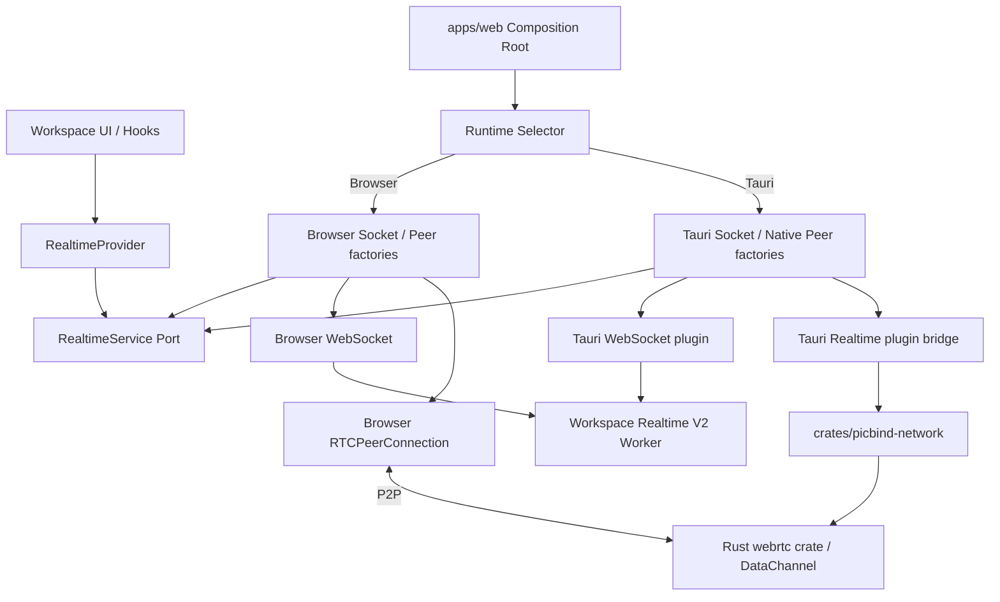

# PicBind Realtime Transport API V1

> 文档状态：阶段 1-6 代码已实施，阶段 17 本地自动化验证已完成；阶段 0 性能/互操作 spike 与阶段 7 发布验证待执行
> 适用范围：当前 Workspace Realtime V2 的 Web 与 Tauri Desktop 实时协作链路
> 明确排除：已弃用的 Share Room、旧 Room 页面及其弱网 WebSocket / WebRTC 实现
> 最后校对：2026-08-28

## 1. 文档目的

PicBind 的 Web 与 Desktop 复用 Workspace UI 和协作业务，但不再强制两端复用浏览器网络
能力：

- Web 使用浏览器 `WebSocket` 和 `RTCPeerConnection`。
- Desktop WebSocket 使用 Tauri 官方 WebSocket plugin。
- Desktop WebRTC 使用 Rust `webrtc` 库，不再使用 WebView 的 `RTCPeerConnection`。
- UI 和 Workspace 业务只依赖稳定的 `RealtimeService`，不判断当前运行于 Web 还是
  Desktop。
- PicBind 自有的 Desktop Native 网络代码、Tauri 注册入口、Rust WebRTC 句柄和生命周期
  统一归属 `crates/picbind-network`。

本文档记录迁移边界、公共接口、平台 Adapter、Native Rust 目录、消息顺序、背压、重连、
生命周期、测试矩阵和任务顺序。除明确标记“待验证”的实机、性能和发布项目外，本文描述的
代码结构已经实现并通过当前 macOS 环境的静态检查和自动化测试。

## 2. 结论摘要

V1 采用以下设计：

1. 只迁移当前 `WorkspaceRealtimeClient` 对应的 Workspace Realtime V2。
2. 已弃用的 Share Room 不进入 V1 契约；遗留 Room 网络代码已删除，不建立兼容层。
3. 对外接口命名为 `RealtimeService` 和 `RealtimeSession`，Workspace 页面不直接创建
   `WebSocket`、`RTCPeerConnection` 或 Tauri WebSocket。
4. 平台选择只在 `apps/web` 的应用组合根发生一次。
5. Web Adapter 包装浏览器 WebSocket 与 WebRTC；Desktop Adapter 包装 Tauri WebSocket
   plugin 与 `crates/picbind-network` 提供的 Rust WebRTC bridge。
6. WebSocket 在 WebRTC 晋升后仍保持连接，继续承担信令、成员状态、可靠消息回退和 RTC
   失效恢复。
7. Desktop WebSocket 的 `send()` 是异步操作，公共实现必须提供 FIFO 写队列；不能直接把
   当前同步的 `WebSocket.send()` 调用逐行替换为异步调用。
8. Desktop WebRTC 使用 Rust `webrtc` crate 的 DataChannel 能力，继续保留
   `workspace-control` 与 `workspace-bulk` 两条有序通道。
9. Web 与 Desktop 共用协议、路由、ACK/NACK、RTC 晋升和回退语义，但底层连接对象互不
   复用。
10. `apps/desktop/src-tauri` 只注册 `picbind-network` 导出的 Tauri plugins；不得复制连接、
    信令、重连、帧转换或 Peer 状态机。

## 3. 当前实现状态

### 3.1 当前有效链路

平台无关 Session Core 位于 `packages/ui/src/workspace/realtime.ts`，由
`WorkspaceRealtimeService` 创建并通过 `RealtimeProvider` 注入 Workspace 页面。Core 负责：

- 调用 `realtimeTicket()` 获取 Workspace、ticket 和 ICE Server。
- 建立 `/api/workspaces/{workspaceId}/realtime-v2` WebSocket。
- 处理成员上线、离线和 owner presence。
- 通过 WebSocket 交换 WebRTC Offer、Answer 和 ICE Candidate。
- 建立 `workspace-control` 与 `workspace-bulk` DataChannel。
- 发送 RTC qualification probe，满足条件后把对应 Peer 晋升为 RTC primary。
- 根据 route、delivery 和 data class 在 RTC 与 WebSocket 之间路由。
- 保存可靠消息，处理 ACK/NACK、sequence gap 和重新发送。
- 在 RTC 断开、丢包、RTT 或 buffered amount 异常时回退 WebSocket。
- WebSocket 断线后按约 1.5 秒至 15 秒的指数退避和 jitter 重连。
- 页面离开时关闭 socket、peer、channel、timer 和 listener。

当前事实是：

> Peer 晋升为 WebRTC 后，WebSocket 不会关闭。WebSocket 是常驻信令与可靠回退通道。

这条行为必须作为迁移契约保留，不能按照旧文档把 WebSocket 误当作一次性 RTC 握手通道。

### 3.2 已弃用 Room 的处理

旧 Share Room 的 Web 页面、UI 入口、SDK wrapper、HTTP signaling、弱网 socket、R2 transfer、
Worker route 和 `ShareRoomObject` 实现已经删除。Cloudflare `wrangler.toml` 只保留历史 `v2`
创建 migration，并通过 `v6 deleted_classes = ["ShareRoomObject"]` 下线已部署 class。

Workspace 仍使用的图片编辑、review、存储和历史数据类型按实际引用保留；部分内部类型仍带
`RoomImage` 等历史名称，但不包含旧 Room 网络或产品入口。TURN 凭据生成已迁到
`services/cloudflare-worker/src/realtime/turn-credentials.ts`，只服务 Workspace Realtime。

### 3.3 当前 Rust 边界

`crates/picbind-network` 现在拥有 Desktop Native 网络边界：

- `websocket/tauri_plugin.rs` 导出官方 Tauri WebSocket plugin 注册入口。
- `webrtc/` 实现 Rust Peer、Offer/Answer、Trickle ICE、两条 ordered DataChannel、入站帧校验
  和每通道 buffered amount 背压。
- `session/` 使用 `sessionId + peerId` 管理句柄和批量清理。
- `tauri/` 提供 commands、raw binary event channel、state、permissions 和窗口/应用退出清理。
- `transfer/mod.rs` 的多 Peer Router 已覆盖独立 qualification、可靠 WebSocket 队列、owner
  broadcast 的逐 Peer 路由和单 Peer 失败隔离。
- Desktop app crate 依赖 `picbind-network`，只注册其 WebSocket 与 Realtime plugins；因 Tauri
  ACL 发现机制，manifest 仍直接声明官方 `tauri-plugin-websocket` 依赖，但不直接注册或实现它。

### 3.4 Tauri WebSocket plugin 能力

Tauri 官方 WebSocket plugin 提供：

- `connect()`、`addListener()`、`send()` 和 `disconnect()`。
- Text、Binary、Ping、Pong 和 Close 消息。
- header、最大 frame/message size、读写缓冲与写入背压配置。
- `websocket:default` capability，包含 connect 和 send 权限。

需要注意两点：

1. plugin 是面向 WebView JavaScript 的 Tauri plugin，不是供 Rust WebRTC 状态机直接调用的
   通用 Rust WebSocket client。
2. plugin 的 JavaScript `send()` 是异步的，Binary 在 plugin 边界可能表现为 `number[]`；
   这些差异必须封闭在 Desktop Socket Adapter 内。

V1 当前组合是“共享 TypeScript 会话策略 + Tauri WebSocket Adapter + Rust WebRTC
Adapter”。如果未来要求 WebSocket 和 WebRTC 的完整会话状态机都在 Rust 中运行，则应在
`picbind-network` 内改用 Rust WebSocket client；那将不再是“使用 Tauri WebSocket plugin”
的方案，不能把两种架构混写为同一个实现。

## 4. 目标与非目标

### 4.1 目标

- Workspace 业务只依赖 `RealtimeService` 和 `RealtimeSession`。
- Web 与 Desktop 保持一致的消息协议、可靠性、路由、晋升和回退行为。
- Desktop 不再创建 WebView `RTCPeerConnection`。
- Desktop WebRTC 的 Rust 实现、Peer 状态、DataChannel 和资源释放全部位于
  `crates/picbind-network`。
- Desktop app crate 只完成 plugin 注册，不拥有网络业务实现。
- Text 与 Binary 在公共层统一为 `string | ArrayBuffer`。
- 所有发送都具备确定的顺序、队列上限和背压行为。
- 页面卸载、窗口关闭、重连和失败回退不会泄漏 socket、peer、channel、timer 或 Rust handle。
- Web-Web、Web-Desktop 和 Desktop-Desktop 可以互操作。

### 4.2 非目标

- V1 不迁移、恢复或兼容旧版 Share Room。
- V1 不改变 Worker 的 Workspace Realtime V2 协议和 endpoint。
- V1 不引入音频、视频或屏幕共享；Rust WebRTC 只使用 DataChannel。
- V1 不把业务事件改造成另一套协议。
- V1 不承诺 Web 与 Desktop 使用同一底层 WebRTC 库或产生完全相同的 SDP 文本。
- V1 不允许 UI 根据平台选择不同业务流程。
- V1 不在首个步骤同时删除所有历史 `room` 命名的存储 scope 或数据库字段。

## 5. V1 架构



核心原则：

> 共享的是 Workspace Realtime 契约和传输策略；Web 与 Desktop 的连接对象、线程模型和
> 生命周期分别由各自 Adapter 管理。

### 5.1 为什么 WebSocket 与 WebRTC 必须一起设计

当前 WebSocket 不只是一个独立消息通道，它还是：

- WebRTC Offer、Answer 和 ICE Candidate 的信令通道。
- 成员存在状态来源。
- RTC qualification 双端确认通道。
- RTC 失败后的可靠传输回退。
- 多 Peer 中未建立 RTC 的目标用户转发通道。

只替换 WebSocket 而不定义 WebRTC Adapter，会让信令、回退、发送顺序和生命周期跨越 DOM
WebSocket、Tauri plugin 与浏览器 WebRTC 三套对象，难以验证。V1 因而同时定义两种传输的
接口；实际实施可以分阶段，但不能分别发明协议。

### 5.2 为什么 Web 与 Desktop 的 WebRTC 分开实现

- Web 必须继续依赖浏览器 ICE、DTLS、SCTP 和 DataChannel 实现。
- Desktop 使用 Rust `webrtc` crate，可以避免关键 P2P 传输继续依赖 WebView 网络栈。
- 两端 SDP、candidate 和 connection state 的原始类型不同，强制暴露同一个底层对象只会把
  平台细节泄漏到业务层。
- 公共层只需要稳定的 Peer/DataChannel 语义，不需要伪造一个完整的 DOM
  `RTCPeerConnection`。

## 6. 分层职责

| 层 | 职责 | 禁止事项 |
| --- | --- | --- |
| Workspace UI / Hooks | 发起连接、发送业务事件、展示连接状态 | 不创建 WebSocket、PeerConnection，不导入 Tauri API |
| `RealtimeService` | 创建一个 Workspace 会话 | 不判断平台，不处理 UI |
| Shared Session Core | 协议、sequence、ACK/NACK、可靠队列、路由、晋升和回退 | 不直接依赖 DOM 或 Tauri 类型 |
| Web Adapter | 包装浏览器 Socket、PeerConnection、DataChannel 和 timer | 不导入 Tauri API |
| Desktop Socket Adapter | 包装 Tauri WebSocket plugin，做帧转换和异步写队列 | 不实现 Workspace 业务事件 |
| Desktop RTC Adapter | 把公共 Peer 操作映射为 `picbind-network` 的 Tauri bridge | 不在 TypeScript 重写 ICE/SCTP 状态机 |
| `picbind-network` | Rust WebRTC、Native Peer/DataChannel、Tauri plugin、句柄和清理 | 不依赖 React、Workspace 页面或 app crate 私有模块 |
| `apps/desktop/src-tauri` | 注册 plugins，提供应用壳 | 不复制网络实现和命令 |
| Cloudflare Worker | ticket、WebSocket relay、成员状态和信令转发 | 不感知客户端是 Web 还是 Desktop |

## 7. 公共契约

公共类型建议放在 `packages/shared/src/realtime/`。Workspace UI 通过 Provider 获取实例，不从
`apps/web` 反向导入实现。

### 7.1 帧、状态与错误

```ts
export type RealtimeFrame =
  | { kind: "text"; data: string }
  | { kind: "binary"; data: ArrayBuffer };

export type RealtimeSessionState =
  | "idle"
  | "connecting"
  | "socket"
  | "rtc"
  | "reconnecting"
  | "unavailable"
  | "closed";

export type RealtimeErrorCode =
  | "ticketFailed"
  | "socketConnectFailed"
  | "socketClosed"
  | "socketQueueFull"
  | "rtcUnavailable"
  | "rtcSignalFailed"
  | "rtcDataChannelFailed"
  | "rtcBackpressure"
  | "invalidFrame"
  | "deliveryRejected"
  | "cancelled"
  | "internal";

export type RealtimeError = {
  code: RealtimeErrorCode;
  message: string;
  retryable: boolean;
  cause?: unknown;
};
```

约束：

- 公共 Binary 一律是 `ArrayBuffer`，不能是 Base64、JSON byte array、Node `Buffer` 或 Tauri
  `number[]`。
- Adapter 可在最外层做一次 `number[]` 与 `ArrayBuffer` 转换，业务和协议代码不能感知。
- 原始 socket close code、RTC state 和 Rust error 可以进入诊断字段，但业务只能依赖稳定 code。

### 7.2 RealtimeService

```ts
export type RealtimeConnectRequest = {
  workspaceId: string;
  role: "owner" | "collaborator";
  shareToken?: string;
  clientId: string;
};

export interface RealtimeService {
  connect(request: RealtimeConnectRequest): Promise<RealtimeSession>;
}

export interface RealtimeSession {
  readonly id: string;
  readonly state: RealtimeSessionState;

  subscribe(listener: (event: RealtimeSessionEvent) => void): () => void;

  send(
    type: string,
    payload: Record<string, unknown>,
    options?: RealtimeSendOptions,
  ): string;

  sendBinary(
    type: string,
    payload: Record<string, unknown>,
    data: ArrayBuffer,
    options?: RealtimeBinarySendOptions,
  ): string;

  removeCollaborator(userId: string): Promise<boolean>;
  close(reason?: string): Promise<void>;
}
```

`send()` 和 `sendBinary()` 继续同步返回客户端生成的 `eventId`，以兼容当前 proposal、source
transfer 和失败跟踪逻辑。同步返回只表示帧已被会话队列接受，不表示已经写入网络或收到
ACK。真实发送失败通过 `deliveryFailed` / `error` 事件返回。

### 7.3 内部 Socket Port

```ts
export interface RealtimeSocketFactory {
  connect(options: RealtimeSocketConnectOptions): Promise<RealtimeSocket>;
}

export interface RealtimeSocket {
  readonly state: "connecting" | "open" | "closing" | "closed";
  subscribe(listener: (event: RealtimeSocketEvent) => void): () => void;
  send(frame: RealtimeFrame): Promise<void>;
  close(code?: number, reason?: string): Promise<void>;
}
```

Socket Port 必须是异步发送接口。Browser Adapter 也包装成 `Promise<void>`，从而让共享会话
使用同一条 FIFO 队列，不依赖 DOM `send()` 恰好同步这一实现细节。

### 7.4 内部 Peer Port

公共 Peer Port 只包含 Workspace DataChannel 需要的能力：

```ts
export interface RealtimePeerFactory {
  create(options: RealtimePeerCreateOptions): Promise<RealtimePeer>;
}

export interface RealtimePeer {
  readonly id: string;
  subscribe(listener: (event: RealtimePeerEvent) => void): () => void;
  createOffer(): Promise<RealtimeSessionDescription>;
  createAnswer(): Promise<RealtimeSessionDescription>;
  setLocalDescription(value: RealtimeSessionDescription): Promise<void>;
  setRemoteDescription(value: RealtimeSessionDescription): Promise<void>;
  addIceCandidate(value: RealtimeIceCandidate): Promise<void>;
  send(channel: "control" | "bulk", frame: RealtimeFrame): Promise<void>;
  bufferedAmount(channel: "control" | "bulk"): Promise<number>;
  close(): Promise<void>;
}
```

不在公共接口暴露 DOM event、Rust struct、Tauri command name、`RTCDataChannel` 或
`RTCPeerConnection`。Web 和 Desktop Adapter 分别完成类型映射。

## 8. 发送顺序、可靠队列与背压

### 8.1 FIFO 发送

- 每个 socket 使用单独 FIFO promise chain 或有界 async queue。
- `connect` 成功前的业务帧进入可靠队列，不直接丢弃。
- signaling 与业务帧必须保持调用顺序；不能为每个 `send()` 创建互不等待的 Promise。
- reconnect 后只重新发送尚未 ACK 的 reliable 帧。
- ephemeral 帧在断线期间允许丢弃，不能占满 reliable 队列。
- RTC 使用独立的 `workspace-control` 与 `workspace-bulk` 通道和各自的 Rust send lock；
  Native Adapter 在 raw IPC 前也为两条通道分别提供有界 FIFO，保证 Tauri invoke 并发不会
  重排 `sourceStart`、分片和 `sourceComplete`；WebSocket fallback 当前仍是单 FIFO。
  fallback 下大量 bulk 对 control 延迟的影响仍需实测，不能标记为已完成的性能保证。
- reliable、bulk 和 ephemeral 分别维护发送 sequence；bulk 分片不能在两个 reliable 事件之间
  制造虚假的 sequence gap。
- source manifest/complete 使用 control，二进制分片使用 bulk；接收 Registry 在 4 个 transfer、
  总计 8 MiB 的边界内暂存先于 manifest 到达的分片，再按 manifest 校验数量、大小和 SHA-256。

### 8.2 队列上限

当前冻结值位于 `packages/shared/src/realtime/limits.ts`：

| 配置 | 当前值 |
| --- | ---: |
| Text frame | 96 KiB |
| Binary frame | 4 MiB |
| Binary header | 32 KiB |
| reliable event | 1,024 条 / 32 MiB |
| socket 待写队列 | 8 MiB |
| RTC control buffered amount | 256 KiB |
| RTC bulk buffered amount | 1 MiB |
| source chunk | 48 KiB |
| 并发 source transfer | 4 |

达到上限时返回 `socketQueueFull` 或 `rtcBackpressure`。单帧 `rtcBackpressure` 将该帧溢出到
常驻 WebSocket，但不关闭 Peer，避免丢弃 DataChannel 中已经接受、尚未送达的 source 分片；
持续 buffered amount 超限仍由健康窗口触发 Peer 回退。禁止无限增长、静默覆盖 reliable 帧
或把大二进制转成 Base64。

### 8.3 Tauri IPC 二进制

Desktop Native RTC 意味着 WebView 中的 Workspace 数据需要跨 IPC 发送到 Rust DataChannel。
该路径是迁移风险最高的部分，必须先做性能 spike：

- 验证 `ArrayBuffer` / `Uint8Array` 到 Rust 的真实复制次数和峰值内存。
- 验证 Rust DataChannel 收包返回 WebView 时的序列化开销。
- 以真实 source chunk、thumbnail 和 preview 大小测试吞吐与 UI 卡顿。
- 优先使用 Tauri 支持的二进制 request/channel；禁止 Base64 和 JSON `number[]` 作为大数据
  正式方案。
- 如果 IPC 不能满足 bulk 传输，Desktop source transfer 应改为受控 Native Store 引用，
  由 `picbind-network` 在 Rust 侧读取并分块，而不是退回 WebView WebRTC。

当前正式路径已使用 Tauri raw invoke body 和 raw `Channel<ArrayBuffer>` event，不使用 Base64 或
业务层 JSON `number[]`。Rust 侧在同一个临界区内分配 Native event sequence 并写入 IPC
Channel，确保 control/bulk 并发回调不会让较小 sequence 后到并被前端误判为 stale event。
但真实 source/thumbnail/preview 的复制次数、吞吐、峰值内存和 UI 长任务尚未测量，因此仍不能
宣称 Native bulk IPC 已通过生产性能门槛。

## 9. Web Adapter

Web 组合使用共享 `WorkspaceRealtimeService` 和 Browser factories：

- `BrowserRealtimeSocketFactory` 创建 DOM WebSocket，设置 `binaryType = "arraybuffer"`。
- `BrowserRealtimePeerFactory` 创建 `RTCPeerConnection` 和两条 ordered DataChannel。
- 当前 ticket、signaling、probe、health check、ACK/NACK、route 和 fallback 逻辑进入共享会话
  Core。
- Browser close/error/message 转换为公共 event。
- 页面卸载时调用 `RealtimeSession.close("page-left")`。

Browser Adapter 不导入 `@tauri-apps/api` 或 `@tauri-apps/plugin-websocket`；平台选择与
Desktop adapter import 只存在于 `apps/web` 组合层，不进入 `packages/ui` Session Core。

## 10. Desktop WebSocket Adapter

Desktop Socket Adapter 使用 `@tauri-apps/plugin-websocket`：

- `connect()` 创建 plugin socket；Promise 成功解析后再派发公共 open event。
- `addListener()` 接收 Text、Binary、Ping、Pong 和 Close，转换为公共 message/close event。
- `connect()` 或 `send()` 的 Promise rejection 转换为公共 error event。
- Text 直接映射，Binary 在 Adapter 边界转为 `ArrayBuffer`。
- Ping/Pong 由 transport 层处理，不作为 Workspace 业务事件。
- `send()` 进入有界 FIFO 异步队列。
- `disconnect()` 必须幂等，并先取消 listener 再释放 plugin handle。
- reconnect 仍由共享 Session Core 控制，不能让 plugin Adapter 私自启动第二套重连循环。

Desktop capability 至少加入：

```json
{
  "permissions": [
    "websocket:default"
  ]
}
```

实际 capability 需继续限定到 `main` window。不能使用无关的全量权限集合。

## 11. Desktop Rust WebRTC Adapter

### 11.1 Rust 库

Desktop DataChannel 已锁定 Rust `webrtc = 0.14.0` 和 Tauri `2.11.5`。当前 macOS Apple
Silicon 已通过 `cargo test/check`；以下发布级验证仍未完成：

- Windows x64 和 Linux x64 编译。
- Offer/Answer、Trickle ICE 和配置的 STUN/TURN 可用。
- ordered DataChannel 的 Text/Binary 双向发送。
- buffered amount 或等价背压信号可观测。
- Peer close、ICE restart、应用退出和异常断开可回收所有 Tokio task。
- 能与浏览器 `RTCPeerConnection` 互操作。

V1 不使用 media track、codec 或屏幕捕获能力，依赖 feature 应尽量收敛到 DataChannel 所需
范围。

### 11.2 Native Handle

`picbind-network` 为每个 Desktop Peer 保存不透明 `peerId`，TypeScript 只能持有 ID：

- Rust state 使用 `sessionId + peerId` 作为唯一键。
- Peer 内部拥有 Rust `RTCPeerConnection` 与 control/bulk DataChannel；远端 SDP 设置前的
  candidate 暂存由 Desktop TypeScript Adapter 有界管理。
- Tauri 事件必须携带 `sessionId`、`peerId` 和单调递增 sequence，防止旧 Peer 事件污染重建
  后的新 Peer。
- command 不得持有全局锁跨越 `.await`；先取得 Arc/handle，再释放 map lock 后执行异步操作。
- close 必须幂等；页面 close、reconnect replacement 和 app exit 都必须触发清理。

### 11.3 Tauri Bridge

`crates/picbind-network` 自己导出 Realtime plugin，负责 commands、event channel、state 和
清理。当前 bridge 能力包括：

```text
realtime_peer_create
realtime_peer_create_offer
realtime_peer_create_answer
realtime_peer_set_local_description
realtime_peer_set_remote_description
realtime_peer_add_ice_candidate
realtime_peer_send
realtime_peer_buffered_amount
realtime_peer_close
realtime_session_close
```

command 名只是内部 bridge，不属于 Workspace 业务 API。`NativeRealtimePeer` 把它们封装为
公共 `RealtimePeer`，页面不得直接 invoke。

## 12. `crates/picbind-network` 所有权

### 12.1 Cargo features

当前按平台能力拆分 feature，避免纯协议测试编译 Tauri/WebRTC：

```toml
[features]
default = []
native-webrtc = ["dep:bytes", "dep:serde", "dep:serde_json", "dep:tokio", "dep:uuid", "dep:webrtc"]
tauri = [
  "native-webrtc",
  "dep:tauri",
  "dep:tauri-plugin-websocket",
]
```

当前 `webrtc` 锁定为 `0.14.0`；只验证了本机 macOS 编译与单元测试，未验证其他 OS 和实机
浏览器互操作。

### 12.2 当前文件结构

```text
crates/picbind-network/
├── Cargo.toml
└── src/
    ├── lib.rs
    ├── session/
    │   ├── mod.rs
    │   ├── handle.rs
    │   └── lifecycle.rs
    ├── signaling/
    │   ├── mod.rs
    │   └── models.rs
    ├── transfer/
    │   └── mod.rs
    ├── websocket/
    │   ├── mod.rs
    │   └── tauri_plugin.rs
    ├── webrtc/
    │   ├── mod.rs
    │   ├── native.rs
    │   ├── peer.rs
    │   └── data_channel.rs
    └── tauri/
        ├── mod.rs
        ├── commands.rs
        ├── events.rs
        ├── plugin.rs
        └── state.rs
```

此外 crate 根目录包含 `build.rs` 与 `permissions/`，用于生成 `picbind-realtime` command ACL。

说明：

- `websocket/tauri_plugin.rs` 只封装官方 WebSocket plugin 注册与 Native 配置，不复制官方
  plugin 的实现。
- `webrtc/native.rs` 定义 Native event/frame，`peer.rs` 与 `data_channel.rs` 实现 Rust WebRTC。
- `tauri/` 只做 bridge 与生命周期，不实现 Workspace 业务协议。
- 稳定 Workspace event、reliability、data class 和 relay envelope 继续归
  `crates/picbind-protocol`；`picbind-network` 不复制协议类型。
- `transfer/mod.rs` 已对齐当前多 Peer qualification、逐目标路由和失败隔离规则。

### 12.3 Desktop app crate

`apps/desktop/src-tauri/src/lib.rs` 的实时网络部分只保留注册：

```rust
tauri::Builder::default()
    .plugin(picbind_network::tauri::websocket_plugin())
    .plugin(picbind_network::tauri::realtime_plugin())
```

具体函数签名以 Tauri 泛型约束实现为准。以下代码不得放入 app crate：

- Rust WebRTC Peer 或 DataChannel。
- SDP、ICE Candidate 或帧转换。
- reconnect、qualification、health check 或 fallback。
- Peer map、session task、写队列或 backpressure。
- Workspace relay、ACK/NACK 或 sequence 规则。

## 13. 组合与依赖注入

当前目录：

```text
packages/shared/src/realtime/
├── contract.ts
├── errors.ts
├── events.ts
├── fifo.ts
├── limits.ts
├── types.ts
├── contract.test.ts
└── index.ts

packages/ui/src/realtime/
├── realtime-context.tsx
├── workspace-realtime-service.ts
└── index.ts

apps/web/src/realtime/
├── create-realtime-service.ts
├── realtime-provider-root.tsx
└── adapters/
    ├── browser-socket.ts
    ├── browser-peer.ts
    ├── tauri-socket.ts
    └── native-peer.ts
```

组合根只判断一次：

```ts
export function createRealtimeService(): RealtimeService {
  return new WorkspaceRealtimeService(isTauri()
    ? {
        socketFactory: new TauriRealtimeSocketFactory(),
        peerFactory: new NativeRealtimePeerFactory(),
      }
    : {
        socketFactory: new BrowserRealtimeSocketFactory(),
        peerFactory: new BrowserRealtimePeerFactory(),
      });
}
```

约束：

- `packages/ui` 不导入 `@tauri-apps/api` 或 `@tauri-apps/plugin-websocket`。
- Workspace hooks 不调用 `isTauri()`。
- Web Adapter 不被 Desktop Adapter 当作 Native 失败回退。
- Native RTC capability 不可用时，Desktop 会话仍可明确停留在 WebSocket，不静默创建 WebView
  `RTCPeerConnection`。

## 14. 生命周期与恢复

### 14.1 页面生命周期

- Provider 或 Workspace effect 创建一个 session。
- workspaceId、shareToken 或角色改变时先 close 旧 session，再创建新 session。
- 页面卸载时等待或触发幂等 close，并立即停止向已卸载页面派发事件。
- Rust session 在前端失联或 window destroyed 时有兜底清理。
- listener unsubscribe 与 transport close 分离，防止 React 重组导致误关连接。

### 14.2 WebSocket 重连

- 保留当前指数退避上限和 jitter，参数进入共享配置。
- 每次重连重新获取 ticket，不能重复使用过期 ticket。
- 同一 session 同时最多只有一次 connect/reconnect task。
- 旧 socket 的 late close/message 通过 generation ID 丢弃。
- RTC primary 存在时 socket 断线不立刻关闭 Peer，但状态和信令可用性必须明确。

### 14.3 RTC 恢复

- RTC failed、closed、DataChannel closed或持续高 RTT/丢包/backpressure 时回退 socket；单次
  `rtcBackpressure` 只把当前帧溢出到 WebSocket，保留 Peer 及其已缓冲帧。
- fallback 后清理旧 Peer handle，再按条件重新发起 Offer。
- WebSocket 可靠队列清空前不晋升 RTC。
- 两端 `transportReady` epoch 一致后才能标记 primary。
- 多 collaborator 时每个 Peer 独立晋升和回退，不能用一个全局 RTC 状态覆盖全部目标。

## 15. 安全与权限

- WebSocket URL 只能来自受信 API origin 和 Workspace V2 path。
- ticket 不写日志，不持久化，不进入错误 message。
- Tauri WebSocket headers 和 URL 在 Adapter 中构建，UI 不允许传入任意本机网络目标。
- capability 只授予 `main` window 所需 websocket 权限。
- Rust bridge 校验 sessionId、peerId、SDP type、candidate 和 frame size。
- 所有反序列化失败返回 `invalidFrame`，不能 panic 或继续处理部分数据。
- remove collaborator 继续要求 owner 角色；Native 化不改变服务端鉴权。
- Tauri 事件不携带本机路径、密钥或完整 ticket。
- Worker 对 TURN API 返回的 ICE URL 去重，并按 STUN、TURN/UDP、TURN/TLS、TURN/TCP 的覆盖
  优先级最多保留 4 个，避免过多 server 拖慢 ICE discovery。

## 16. 分阶段任务

### 阶段 0：冻结范围与完成 spike

- [x] 确认 Workspace Realtime V2 是唯一产品链路。
- [x] 通过引用、route 和构建检查列出并删除旧 Room 网络代码。
- [x] 冻结当前 WebSocket/RTC route、ACK/NACK、probe、health 与 reconnect 行为。
- [x] 通过 Adapter 测试和 macOS 编译验证 Tauri WebSocket 的 Text/Binary、close、FIFO 和 capability。
- [ ] 验证 Rust `webrtc` 与 Browser WebRTC 的 DataChannel 互操作。
- [ ] 测量 Native RTC 二进制 IPC 的吞吐、复制、内存和 UI 卡顿。
- [x] 冻结队列、frame、buffered amount 和 source chunk 上限。

完成条件：可以用可重复测试证明 Desktop Native RTC 技术路径和二进制桥接可用。

### 阶段 1：冻结公共契约

- [x] 新建 `packages/shared/src/realtime/`。
- [x] 定义 Service、Session、Socket、Peer、Frame、State、Event 和 Error。
- [x] 为同步 eventId、异步发送结果和 delivery failure 定义语义。
- [x] 添加 FIFO、Browser、Tauri 和 Native Adapter contract tests。

完成条件：Web/Desktop Adapter 可以使用同一测试套件，UI 不依赖任何平台类型。

### 阶段 2：包装现有 Web 实现

- [x] 把 `WorkspaceRealtimeClient` 拆为共享 Session Core 与 Browser factories。
- [x] 保留当前协议和运行行为，不在这一步调整 WebRTC 策略。
- [x] 新增 RealtimeProvider 并迁移 Workspace hooks。
- [x] 清除 Workspace 生产代码中的直接 `new WebSocket` 和 `new RTCPeerConnection`。
- [x] 完成现有 Web 静态检查和 Workspace/Adapter 回归测试。

完成条件：Web 行为不变，业务只依赖 `RealtimeService`。

### 阶段 3：接入 Desktop WebSocket plugin

- [x] 在 workspace 依赖中加入 Tauri WebSocket plugin Rust 与 npm 包。
- [x] 由 `picbind-network` 导出 WebSocket plugin 注册入口。
- [x] 在 Desktop capability 加入仅限 `main` window 的 websocket 权限。
- [x] 实现 `TauriRealtimeSocketFactory` 和有界 FIFO 写队列。
- [ ] 验证 ticket、成员状态、信令和纯 WebSocket 业务传输。

完成条件：Desktop 禁用 RTC 时可通过 Tauri WebSocket 完成 Workspace 协作。

### 阶段 4：实现 Native Rust WebRTC

- [x] 为 `picbind-network` 增加 `native-webrtc` 与 `tauri` features。
- [x] 实现 Rust Peer、ICE、Offer/Answer、candidate 和两条 ordered DataChannel。
- [x] 实现 Tauri Realtime plugin、commands、raw events、state 和 close。
- [x] 实现 Desktop `RealtimePeerFactory`。
- [ ] 完成 Web-Desktop 与 Desktop-Desktop DataChannel 互操作测试。
- [ ] 验证应用退出、页面关闭、Peer replacement 和异常断线清理。

完成条件：Desktop 不再调用 WebView `RTCPeerConnection`，RTC 失败可回退 Tauri WebSocket。

### 阶段 5：对齐路由、可靠性和弱网行为

- [x] 对齐 `TransportRouter` 与当前多 Peer route 语义。
- [x] 通过单元测试验证 ACK/NACK、sequence gap、reliable resend 和 delivery failure。
- [x] 实现 qualification、ready epoch、健康窗口、入站限制和 backpressure，并覆盖核心单元测试。
- [ ] 验证 socket reconnect 期间 RTC primary 的行为。
- [ ] 验证 control 不被 bulk 大流量阻塞。

完成条件：Web 与 Desktop 在相同输入下产生等价 transport 选择和业务事件。

### 阶段 6：清理旧 Room 和平台泄漏

- [x] 删除确认不可达的旧 Room WebSocket/WebRTC、route、export 和测试。
- [ ] 保留仍被 Workspace 使用的通用 review、图片和存储模块，并按真实职责重命名。
- [x] 检查 `packages/ui` 不再导入 Tauri network API。
- [x] 检查业务代码没有 `isTauri()` 网络分支。
- [x] 更新仓库结构和 Desktop 开发文档。

未勾选的重命名项仅指仍被 Workspace 使用的历史 `RoomImage` 等内部名称；旧 Room 网络实现和
生产入口已经清零，不影响唯一协议边界。

完成条件：仓库只有一套在用的 Workspace Realtime 业务协议和一套跨平台 Service 契约。

### 阶段 7：切换与发布验证

- [ ] 通过 Web-Web、Web-Desktop、Desktop-Desktop 全矩阵。
- [ ] 完成 macOS、Windows、Linux Desktop 实机测试。
- [ ] 验证安装包 capability、CSP 和生产 WSS/TURN 环境。
- [x] 记录 Native RTC feature 和回滚条件：Tauri build 使用 `tauri` feature，RTC 失败只回退
  Tauri WebSocket，禁止回退 WebView RTC。
- [x] 生产代码未保留临时诊断日志、测试开关或 fake transport。

完成条件：Desktop 默认使用 Tauri WebSocket + Rust WebRTC，且不存在静默 WebView RTC 回退。

## 17. 测试矩阵

### 17.0 当前验证结果

2026-08-28 在 macOS Apple Silicon 本地完成：

- Shared realtime contract：3 项通过。
- Browser/Tauri/Native Adapter：13 项通过，覆盖 ArrayBuffer、ordered channel、ICE 暂存、
  raw IPC FIFO、Rust 背压映射、sequence 丢弃、初始化失败清理、入站限制、FIFO drain 和
  幂等 close。
- Workspace tests：62 项通过，其中 realtime Core 覆盖多 Peer、逐目标路由、单 Peer 定向回退、
  WebSocket 常驻、ACK、Trickle ICE、bulk 背压溢出、可靠 sequence 隔离和幂等 close。
- Worker 普通测试 36 项、Worker runtime 测试 34 项通过，dry-run build 通过；TURN ICE URL
  去重和上限另有定向覆盖。
- `cargo test -p picbind-network --features tauri` 7 项通过，包含 Native event 并发有序派发；
  `cargo check -p picbind-network --features tauri` 与 `cargo check -p picbind-desktop` 通过。
- Shared、UI、Web TypeScript check 通过。

以上结果是本地契约、单元和编译验证，不等价于下面的真实端到端、TURN、性能或长期资源测试。

### 17.1 Adapter 契约测试

每个 Socket/Peer Adapter 都执行：

- Text 与 Binary 原样往返。
- 多次订阅/取消订阅不重复派发。
- close 幂等，close 后禁止发送。
- 异步 send 保持 FIFO。
- queue full 返回稳定错误。
- stale generation 事件被丢弃。
- connect 失败、remote close、invalid frame 和 listener error 可恢复。

### 17.2 端到端组合

| Owner | Collaborator | 必测传输 |
| --- | --- | --- |
| Web | Web | Browser WS + Browser RTC |
| Web | Desktop | Browser WS/RTC + Tauri WS/Rust RTC |
| Desktop | Web | Tauri WS/Rust RTC + Browser WS/RTC |
| Desktop | Desktop | Tauri WS + Rust RTC |

每种组合至少验证：

- owner/collaborator 上线与离线。
- Offer、Answer、Trickle ICE、TURN fallback。
- control/bulk DataChannel 打开与 RTC 晋升。
- proposal、commit、reaction、message、preview 和 source binary。
- 多 collaborator 定向消息与 workspace broadcast。
- ACK、NACK、sequence gap 和 reliable resend。
- WebSocket 断线重连、RTC 失败回退和再次晋升。
- 高频 preview 与大 source transfer 下 control 消息延迟。
- 页面退出、切换 Workspace、窗口关闭和应用退出。

### 17.3 弱网和资源测试

- RTT 500ms qualification 边界。
- RTT 1500ms 持续退化。
- 30% 丢包窗口。
- DataChannel buffered amount 达 1 MiB。
- WebSocket 1.5s 至 15s 退避与 jitter。
- 断网、恢复、网络切换、系统休眠和唤醒。
- 100 次 Peer 创建/销毁后 Rust task、socket 和内存稳定。
- 大 Binary IPC 不造成主线程长任务和不可控内存峰值。

算法阈值已冻结在 `REALTIME_LIMITS` / `REALTIME_QUALITY`；本节弱网场景和资源门槛仍需真实
链路执行。若产品要修改阈值，应作为单独行为变更评审。

## 18. Review 清单

- [ ] 是否只覆盖 Workspace Realtime V2，没有把旧 Room 带回契约。
- [ ] `packages/ui` 是否完全不导入 Tauri network API。
- [ ] 平台选择是否只发生一次。
- [ ] Desktop 是否没有创建 WebView `RTCPeerConnection`。
- [ ] 所有 PicBind Native 网络代码是否位于 `crates/picbind-network`。
- [ ] `apps/desktop/src-tauri` 是否只有 plugin 注册。
- [ ] Binary 是否始终以 `ArrayBuffer` 进入公共层。
- [ ] Tauri async send 是否有 FIFO、有界队列和背压。
- [ ] WebSocket 是否在 RTC 晋升后继续作为信令和回退通道。
- [ ] 多 Peer 是否独立晋升和回退。
- [ ] 可靠消息是否只在 ACK 后移出。
- [ ] 页面、窗口和应用退出是否都能清理 Rust/Web 资源。
- [ ] Web-Web、Web-Desktop 和 Desktop-Desktop 是否全部通过。
- [ ] Native RTC 失败时是否明确停留 WebSocket，而不是静默使用 WebView RTC。

## 19. V1 验收标准

V1 只有满足以下条件才算完成：

- Workspace UI 只通过 `RealtimeService` 使用实时协作。
- Web 使用 Browser WebSocket + Browser WebRTC。
- Desktop 使用 Tauri WebSocket plugin + Rust WebRTC。
- Desktop 的 Rust WebRTC、Tauri bridge 和 plugin 注册入口归 `crates/picbind-network`。
- Desktop app crate 没有网络状态机或协议实现。
- 旧 Share Room 没有进入新 API，确认不可达的遗留网络代码已删除。
- Text/Binary、可靠队列、ACK/NACK、sequence、路由、晋升、回退和重连语义一致。
- 三种端间组合和三种 Desktop OS 验证通过。
- 大 Binary Native RTC IPC 通过性能与内存门槛。
- 页面和应用退出后没有残留连接、listener、timer、Tokio task 或 Peer handle。

当前尚未满足完整 V1 验收：Web-Desktop/Desktop-Desktop 实机互操作、真实 TURN、Native bulk
IPC 性能与内存、100 次 Peer 生命周期、生产 CSP/WSS/TURN、Windows 和 Linux 均未验证。
因此当前状态是“实现与本地自动化完成，发布验收待执行”，不能标记为生产验收完成。

## 20. 相关文件与资料

当前实现：

- `packages/shared/src/realtime/`
- `packages/ui/src/realtime/`
- `packages/ui/src/workspace/realtime.ts`
- `packages/ui/src/workspace/realtime-protocol.ts`
- `packages/ui/src/workspace/realtime-client.test.ts`
- `packages/ui/src/workspace/api.ts`
- `apps/web/src/realtime/create-realtime-service.ts`
- `apps/web/src/realtime/realtime-provider-root.tsx`
- `apps/web/src/realtime/adapters/`
- `crates/picbind-network/src/session/`
- `crates/picbind-network/src/signaling/`
- `crates/picbind-network/src/transfer/mod.rs`
- `crates/picbind-network/src/websocket/`
- `crates/picbind-network/src/webrtc/`
- `crates/picbind-network/src/tauri/`
- `services/cloudflare-worker/src/realtime/workspace-object.ts`
- `services/cloudflare-worker/src/realtime/turn-credentials.ts`

参考：

- [Tauri WebSocket plugin](https://v2.tauri.app/plugin/websocket/)
- [Tauri WebSocket JavaScript API](https://v2.tauri.app/reference/javascript/websocket/)
- [webrtc-rs](https://github.com/webrtc-rs/webrtc)
- `docs/architecture/REPOSITORY_STRUCTURE.md`
- `docs/architecture/desktop/PICBIND_IMAGE_PROCESSING_API_V1.md`
