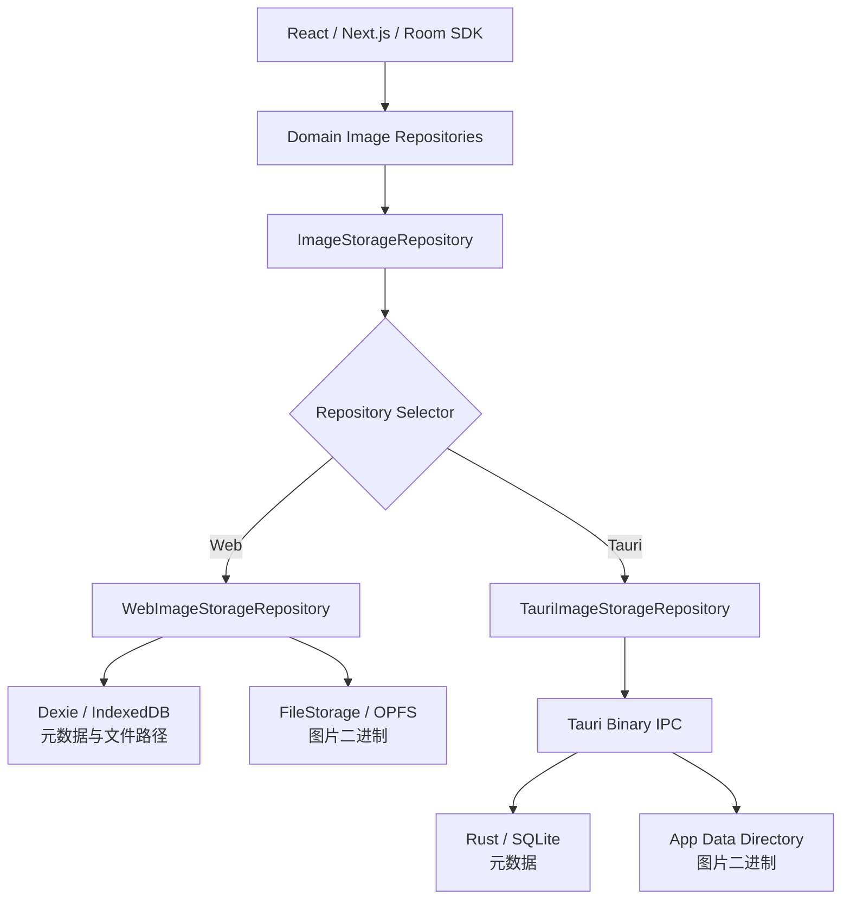
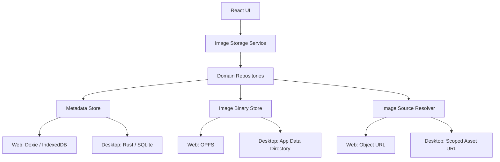
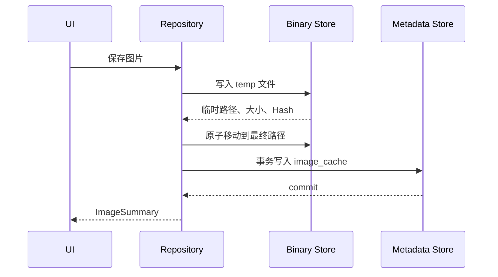

# PicBind Tauri 图片存储架构 V2

> 文档状态：Native Store V2 已实现，跨平台压力测试待完成
> 适用范围：图片二进制缓存与关联元数据
> 当前产品版本：Tauri `0.1.0`，Web `1.0.8`
> 最后校对：2026-08-05

## 1. 文档目的

本文档定义 PicBind 图片存储架构 V2 的目标、边界和实施顺序，重点解决大量图片下的
磁盘占用、读取延迟、内存峰值和缓存清理问题。

本文档同时记录已经实现的 Native Store V2 和仍需验证的跨平台边界。Repository 接口分层、
分页懒加载、容量清理和异常恢复已经落地；旧缓存迁移、scoped asset URL 和 Windows/Linux
实机验证不属于当前能力。

## 2. 结论摘要

当前架构已经具备 Repository Layer，图片二进制也没有存入 localStorage 或
IndexedDB：

- Dexie / IndexedDB 保存图片元数据和 OPFS 路径。
- OPFS 保存原图、压缩结果、缩略图和消息图片等二进制文件。
- Repository 负责协调元数据和二进制文件的写入、读取与删除。

V2 实施前的主要性能问题不是“缺少 Repository”，而是 Repository 的读取和容量治理策略：

- 列表查询曾一次性读取全部图片 Blob。
- 多张图片曾通过无上限 `Promise.all` 并发读取。
- Room 图片和压缩结果曾缺少分页、懒加载和统一容量上限。
- Web 与 Tauri 的存储差异曾散落在业务 Repository 的条件分支中。

当前业务 Repository 只依赖统一 `ImageStorageRepository` 接口。运行时选择器只执行一次
平台判断：Web 使用独立的 Dexie + OPFS Repository，Tauri 使用独立的 IPC + Native Store
Repository。压缩图、Room 和消息图片已经提供分页元数据与按 ID/variant 读取接口；旧的
完整 Blob 列表函数只作为业务便捷方法保留。

## 3. 当前实现

### 3.1 当前调用链



主要实现位置：

```text
apps/web/src/database/repositories/
├── compressed-image-repository.ts  # 共享入口转发
└── queued-file-repository.ts        # 共享入口转发

packages/ui/src/database/
├── database.ts
├── file-storage.ts
├── native-image-storage.ts
└── repositories/
    ├── image-storage-repository.ts
    ├── image-storage-repository-selector.ts
    ├── web-image-storage-repository.ts
    ├── tauri-image-storage-repository.ts
    ├── compressed-image-repository.ts
    ├── queued-file-repository.ts
    ├── room-image-repository.ts
    └── messaging-image-repository.ts
```

### 3.2 当前图片存储矩阵

| 图片类型 | 元数据 | 二进制 | 当前入口 |
| --- | --- | --- | --- |
| 待压缩原图 | Dexie `queuedFiles` | OPFS `temp/compression/` | Queued File Repository |
| 压缩结果 | Dexie `compressedImages` | OPFS `files/compressed/` | Compressed Image Repository |
| Room 图片 | Dexie `roomImages` | OPFS `files/images/` | Room Image Repository |
| Room 缩略图 | `roomImages.thumbnailPath` | OPFS `thumbnails/images/` | Room Image Repository |
| 消息图片 | Dexie `messagingImages` | OPFS `cache/messaging/` | Messaging Image Repository |

在 Tauri 中，上述四类图片分别使用 `compressed`、`queued`、`room`、`messaging` scope。
SQLite 保存业务元数据和相对文件路径，二进制保存到应用数据目录；Web 表中的路径和
OPFS 目录保持不变。

localStorage 中与图片有关的 `picbind:compression-handoff` 只保存待处理文件 ID，不保存
Blob、Base64 或图片内容。

### 3.3 当前 Tauri 行为

Tauri 仍直接运行现有 Web 前端，但图片 Repository 会通过官方 Tauri API 检测运行
环境。Tauri 中的压缩结果、待处理原图、Room 图片/缩略图和消息图片使用 Native
Store；Review History、Operation Log、页面状态等非图片数据仍保持原存储方式。

Native Store 当前已经实现：

- Rust `rusqlite 0.39.0` 管理 SQLite 元数据，schema `user_version = 2`。
- 图片写入应用数据目录，文件名使用 SHA-256 内容哈希。
- 待处理原图写入 `temp/queued/`，消息图片写入 `cache/messaging/`，其余图片按资产和
  派生文件分类保存。
- 临时文件写入、`sync_all` 和同文件系统原子 rename。
- 有限的业务 command、参数化 SQL、相对路径校验和引用计数删除。
- 写入与读取均使用二进制 IPC，不把图片编码成 JSON 数字数组。
- Repository 显式内容读取使用 4 路有界并发并接受 `AbortSignal`。
- 启动时清理无引用 temp、孤儿文件和缺失缓存记录，并执行消息缓存/派生缩略图 LRU。

开发环境加载 `http://localhost:3000`，正式静态资源将使用 Tauri 自身 origin。不同
origin 的 IndexedDB/OPFS 数据彼此隔离，不能假设开发缓存会自动出现在正式客户端。

### 3.4 已处理的性能问题

1. 列表阶段不再隐式读取全部原图；新 UI 使用元数据分页和按需内容读取。
2. 可见项加载和兼容批量读取均使用有界并发，页面切换可通过 `AbortSignal` 停止后续读取。
3. 消息缓存和派生缩略图受 512 MB、30 天和单批 250 项的 LRU 策略约束。
4. Web 图片存储的 Dexie schema 由 Room SDK 单点维护，当前版本为 V5。
5. Web 和 Tauri 各自实现 `ImageStorageRepository`，业务 Repository 不再包含平台条件分支。

## 4. V2 目标与非目标

### 4.1 目标

- UI 列表只获取轻量元数据，不自动读取完整图片。
- 缩略图、预览图和原图按显示或处理需求分别加载。
- 图片读取具有分页、取消和并发上限。
- Repository API 不向业务层暴露 Dexie Table、SQLite connection 或任意文件路径。
- Web 与 Desktop 使用一致的业务语义和数据模型。
- Desktop 图片二进制存入应用数据目录，SQLite 只保存元数据和相对路径。
- 缓存具备容量统计、清理、失败恢复和孤儿文件回收能力。

### 4.2 非目标

- 本文档不修改 JPEG、PNG、WebP、AVIF 的编码算法或压缩参数。
- 本文档不决定由 WASM 还是 Rust Native 执行图片压缩。
- 本文档不新增账号、项目管理、云同步或上传队列。
- 本文档不定义签名、自动更新或多平台安装包流程。
- 本文档不处理语言、房间 Token、页面恢复等 localStorage/sessionStorage 状态。
- 开发阶段不迁移旧 Dexie/OPFS 或旧 Native Store 图片缓存；切换实现后直接清理缓存。

如果后续由 Rust Native 接管编码器或压缩流程，必须作为独立任务设计，并同步更新
`docs/product/collaboration/COMPRESSION_ALGORITHM.md`。

## 5. V2 目标架构



核心原则：

> Repository 负责业务一致性，Store Adapter 负责运行环境差异，UI 不直接访问数据库
> 或文件系统。

### 5.1 分层职责

| 层 | 职责 | 禁止事项 |
| --- | --- | --- |
| Image Storage Service | 向 UI 提供分页列表、按需加载、删除和容量查询 | 不暴露数据库或绝对路径 |
| Domain Repository | 协调元数据、文件、引用关系和事务补偿 | 不依赖具体 UI 组件 |
| Metadata Store | 保存结构化元数据、索引和 schema migration | 不保存图片 Blob |
| Image Binary Store | 原子写入、读取、删除和统计图片文件 | 不决定业务保留策略 |
| Image Source Resolver | 生成可展示资源并管理生命周期 | 不允许任意路径访问 |

## 6. Repository API 设计

V2 不使用一个返回完整 Blob 的 `listImages()`。列表和内容读取必须分开。

```ts
interface ImageStorageRepository {
  put<T>(input: PutImageStorageInput<T>): Promise<ImageStorageRecord<T>>;
  get<T>(scope: ImageStorageScope, scopeKey: string, id: string):
    Promise<ImageStorageRecord<T> | null>;
  list<T>(scope: ImageStorageScope, scopeKey: string, limit: number, offset: number):
    Promise<Array<ImageStorageRecord<T>>>;
  read(scope: ImageStorageScope, scopeKey: string, id: string,
    variant: ImageStorageVariant, mimeType: string, signal?: AbortSignal):
    Promise<Blob | null>;
  delete(scope: ImageStorageScope, scopeKey: string, id: string): Promise<void>;
  clear(scope: ImageStorageScope, scopeKey?: string): Promise<void>;
  pruneCache(policy: ImageCachePolicy): Promise<ImageCachePruneResult>;
}
```

接口约束：

- `list()` 只能返回元数据，不得隐式读取原图 Blob。
- Gallery 默认只请求 thumbnail；进入预览或处理流程时才请求 original/output。
- Desktop 不向 UI 返回可访问任意本机文件的裸绝对路径。
- `limit` 必须设置上限，当前使用 offset/limit，Repository 不接受无限列表查询。
- 批量图片读取必须支持取消，并设置有界并发。
- 业务 Repository 不允许导入 Dexie、OPFS 或 Tauri `invoke`；这些依赖只能出现在对应的
  平台 Repository 内。

## 7. 图片分类与保留策略

“用户资产”和“可删除缓存”必须分开，不能统一放入可随时清理的 cache 目录。

| 分类 | 示例 | 默认保留规则 |
| --- | --- | --- |
| Managed Asset | 用户导入的原图、明确保存的输出 | 用户删除前保留，不参与自动清理 |
| Derived Asset | 缩略图、预览图 | 可重新生成，可按 LRU 清理 |
| Message Cache | 收发消息中的本地副本 | 按数量、时间或容量清理 |
| Temporary File | 压缩交接、未完成写入、中间产物 | 成功后删除，异常退出后回收 |

当前 Desktop 可删除缓存的默认上限为 512 MB，最长保留 30 天，单次清理最多处理
250 项；消息图片仍同时遵守“每个 Room 最多 100 张”。Managed Asset 不受这些上限影响。
后续如调整这些值，应把它们提升为显式产品配置并同步更新本文档。

## 8. Desktop 文件目录

Desktop 必须通过 Tauri/Rust 的应用数据目录 API 获取根目录，不得在业务代码中拼接
用户主目录或硬编码平台路径。

逻辑目录建议如下：

```text
<app-data>/
├── database/
│   └── picbind.sqlite
├── assets/
│   ├── original/
│   └── output/
├── derived/
│   ├── thumbnails/
│   └── previews/
├── cache/
│   └── messaging/
└── temp/
```

目录规则：

- SQLite 只保存相对于 `<app-data>` 的路径。
- 文件名使用内部 ID 或内容哈希，不直接信任用户文件名。
- 所有路径在 Rust 层规范化并校验，拒绝 `..`、绝对路径和越界访问。
- 临时写入与最终文件必须位于同一文件系统，以支持原子 rename。
- 用户原文件默认只读，不得被缓存清理或失败回滚误删。

应用数据目录由操作系统决定，典型位置包括：

| 平台 | 典型目录 | 说明 |
| --- | --- | --- |
| macOS | `~/Library/Application Support/<bundle-id>/` | 实际路径由系统 API 返回 |
| Windows | `%APPDATA%\<bundle-id>\` | 不硬编码用户名或盘符 |
| Linux | `$XDG_DATA_HOME/<bundle-id>/` | 缺省值由系统 API 处理 |

## 9. SQLite 元数据模型

V2 只处理图片存储，不引入 users、projects、sync_queue 等无关业务表。

### 9.1 当前已实现：`image_cache`

当前 schema 使用一张最小业务记录表：

```text
scope             TEXT NOT NULL
scope_key         TEXT NOT NULL
id                TEXT NOT NULL
metadata_json     TEXT NOT NULL
mime_type         TEXT NOT NULL
file_path         TEXT
thumbnail_path    TEXT
byte_size         INTEGER NOT NULL
created_at        INTEGER NOT NULL
updated_at        INTEGER NOT NULL
last_accessed_at  INTEGER
PRIMARY KEY (scope, scope_key, id)
```

`file_path` 和 `thumbnail_path` 只保存相对于应用数据目录的路径。Room 占位记录允许
`file_path` 为空，后续收到原图时更新同一记录。相同内容通过哈希文件名自然共享，删除
记录时只有路径不再被其他记录引用才删除文件。

### 9.2 V2 维护模型

V2 保持单表 `image_cache`。当前没有迁移 checkpoint 表，不拆分 `image_objects`，也没有
引入 `writing`、`ready`、`delete_pending` 状态；一致性由原子 rename、数据库事务、
引用计数删除和启动恢复扫描共同保证。

### 9.3 Schema 版本

- 当前 SQLite schema 为 `user_version = 2`，启动时会显式把 V1 迁移到 V2。
- 后续版本必须使用显式、单调递增的 migration，并提供失败回滚或恢复路径。
- Rust 层是 Desktop schema 的唯一所有者，前端不得直接执行任意 SQL。
- Web Dexie schema 和 Desktop SQLite schema 可以采用不同物理结构，但业务语义必须
  通过 Repository 契约保持一致。

## 10. 读写流程

### 10.1 写入图片



失败处理：

- 文件写入失败时不写元数据。
- 元数据事务失败时删除刚写入的文件；删除失败则标记为孤儿文件，交由恢复任务处理。
- 不允许使用“数据库成功、文件仍在半写入状态”的记录。
- 不覆盖用户原文件。

### 10.2 列表读取

1. Repository 分页读取元数据。
2. UI 只为可见项请求 thumbnail。
3. 滚动离开可见区域后释放不再使用的 Object URL。
4. 打开预览时再请求 preview 或 original。
5. 并发读取通过队列限制，页面切换时取消未开始或不再需要的任务。

### 10.3 删除图片

1. 在事务中删除或解除业务引用。
2. 删除 `image_cache` 记录。
3. 只有文件路径不再被其他记录引用时才删除二进制文件。
4. 异常中断遗留的文件由下次启动恢复扫描处理。

## 11. 缓存治理

V2 当前提供以下能力：

- 按分类统计文件数量和磁盘占用。
- 按 `last_accessed_at` 执行 LRU 清理；默认上限为 512 MB，最长保留 30 天，单次最多
  处理 250 项。
- Managed Asset 永不参与自动清理。
- Derived Asset 和 Message Cache 可以按策略清理。
- 启动时清理无数据库引用的 temp 文件。
- 启动时扫描数据库记录与文件目录：消息/压缩/queued 主文件缺失时删除失效记录，Room
  主文件缺失时保留元数据并降级为占位记录，缩略图缺失时清空引用，管理目录中的无引用
  文件直接回收。
- 磁盘空间不足时停止新写入并返回明确错误，不静默删除用户资产。

清理任务不得与前台读取直接争抢无限 IO；需要低优先级队列、批次上限和取消机制。

## 12. Web 实现调整

Web 继续使用 Dexie + OPFS，不回退到 IndexedDB Blob。当前已经完成：

1. 新增 `listRoomMetadata()`、`listCompressedMetadata()`、
   `listMessagingImageMetadata()`，旧完整列表接口保留为兼容层。
2. 增加按 ID 和 variant 读取图片的接口。
3. 为列表增加 offset/limit，并保证先排序再分页。
4. 为缩略图读取增加有界并发和取消。
5. Web 图片 schema 统一由 Room SDK 的 Dexie database 模块维护。
6. Web 应用通过 SDK 共享入口使用 compressed/queued 业务 Repository，不再维护重复实现。
7. Web 与 Tauri 分别实现 `ImageStorageRepository`，运行环境只由 selector 判断一次。

这些调整不得改变图片压缩算法或输出结果。

## 13. Desktop 实现边界

Desktop Native Storage 建议放在 Rust 层，由有限的业务 command 暴露能力：

```text
apps/desktop/src-tauri/src/storage/
├── mod.rs
├── database.rs
├── files.rs
└── commands.rs
```

建议提供业务级命令，例如：

- `storage_list_images`
- `storage_get_image_source`
- `storage_delete_image`
- `storage_get_usage`
- `storage_prune_cache`
- `storage_recover`

禁止提供“读取任意路径”“写入任意路径”或“执行任意 SQL”的通用命令。前端展示本地
图片时应使用限定在 PicBind 数据目录内的 scoped asset URL 或等价安全机制，避免把
大图片通过 JSON/IPC 序列化为完整 ArrayBuffer。

当前实现位于 `apps/desktop/src-tauri/src/storage/`，使用应用内单连接 `rusqlite`，通过互斥锁
串行访问。已注册的命令为：

- `storage_put_image`
- `storage_get_image`
- `storage_list_images`
- `storage_read_image`
- `storage_delete_image`
- `storage_clear_images`
- `storage_get_usage`
- `storage_prune_cache`
- `storage_recover`

写入请求把元数据和图片组合成一个二进制帧，读取直接返回二进制 response。前端不能
传入文件路径或 SQL。prune 和恢复命令已实现；scoped asset URL 尚未实现，当前按需读取
仍使用受控二进制 IPC。

## 14. 开发阶段数据策略

当前处于开发阶段，不实施旧图片缓存兼容：

- Web 继续使用自己的 Dexie + OPFS 数据。
- Tauri 直接使用 SQLite + 应用数据目录，不读取或复制旧 OPFS 图片。
- Repository 重构、schema 或目录调整后，由开发者清理旧缓存重新验证。
- 不提供 migration checkpoint、失败重试或旧缓存清理 UI。

SQLite 的 `user_version` 升级仍然保留。它只管理 Native Store 数据库结构，不负责把 Web
图片缓存迁移到 Tauri。

## 15. 安全要求

- Rust 只接受内部 ID、variant 和受控查询参数，不信任前端传入路径。
- 所有最终路径必须位于应用数据目录内。
- 不为存储功能启用 Shell 权限。
- 不为方便展示而开放整个用户目录或全局文件协议访问。
- SQLite 使用参数化查询。
- 日志不得记录图片内容、Token、用户绝对路径或敏感 EXIF 信息。
- 删除操作必须区分 PicBind 管理文件和用户原文件。

## 16. 实施阶段

### Phase A：Repository 适配器分流（已完成）

- Web 保持 Dexie + OPFS。
- `ImageStorageRepository` 定义统一存储契约。
- Web 和 Tauri 使用完全独立的平台 Repository 实现。
- Selector 只执行一次运行环境选择，业务 Repository 不包含平台判断。
- 保持现有 Blob 返回契约，避免同时改动 UI 和业务 Store。
- Tauri 多图恢复使用 4 路有界并发。

### Phase B：Desktop Native Store 基础层（已完成）

- Rust SQLite metadata store。
- 应用数据目录 binary store。
- 二进制 IPC、原子写入、参数化查询和无引用文件删除。
- compressed、queued、room、messaging 四类图片接入。

### Phase C：元数据列表与按需读取（已完成）

- 元数据列表与 Blob 读取分离。
- 增加分页、懒加载、取消和有界并发。
- 对齐 Web 与 Room SDK schema。
- 增加 Repository 契约测试。

### Phase D：开发数据切换（已完成）

- 不兼容或迁移旧 Dexie/OPFS 图片缓存。
- 不提供 migration checkpoint 和旧缓存清理入口。
- Repository 或 schema 变更后直接清理开发缓存。

### Phase E：容量治理（已完成基础能力）

- 按分类统计主文件、缩略图、temp 和孤儿文件的实际磁盘占用。
- Derived/Message 缓存 LRU 策略。
- temp、孤儿文件和缺失记录恢复；当前未采用 `delete_pending` 状态。
- 压力测试和长时间运行验证。

Rust Native 图片编码和后台同步不属于上述阶段，需单独立项。

## 17. 验收标准

### 17.1 当前已通过

- Web 与 Room SDK TypeScript 检查通过。
- Rust 格式、编译检查和 Native Store 单元测试通过。
- macOS Tauri 客户端已启动，应用数据目录和 SQLite V2 schema 初始化成功。
- 业务 Repository 只依赖统一接口；Web 使用独立 Dexie + OPFS Repository，Tauri 使用
  独立 Native Store Repository。
- SQLite 不保存图片 Blob，文件只写入 PicBind 应用数据目录。
- 二进制 IPC、内容哈希文件名、原子写入和无引用删除已经落地。
- Web Repository 的写入、元数据分页、按需读取、取消和删除契约测试通过。

以下通用功能已由类型检查、Rust 单元测试和 macOS Tauri 实机流程覆盖；1000 条数据的
专项压力测试和 Windows/Linux 实机验证仍待完成。

### 17.2 通用 Repository

- 列表查询不读取原图 Blob。
- 1000 条元数据分页查询不会创建 1000 个 Blob 或 Object URL。
- 图片读取支持取消并有明确并发上限。
- 删除图片时元数据与文件最终一致。
- 缺失文件和孤儿文件能够被检测并恢复或清理。

### 17.3 Web

- 继续使用 Dexie + OPFS。
- Web 构建和 Cloudflare Pages 部署方式不变。
- 压缩、Room、Review 和消息图片流程无行为回归。
- 同格式不增大和 Alpha 保护等压缩规则不受影响。

### 17.4 Desktop

- SQLite 不保存图片 Blob。
- 图片文件只写入 PicBind 应用数据目录。
- 列表和缩略图展示不通过 IPC 传输完整原图。
- 应用启动时能够处理无引用 temp、孤儿文件和缺失记录；当前模型不使用 `writing` 或
  `delete_pending` 状态。
- macOS、Windows、Linux 只有在各平台完成实际验证后才标记支持。

### 17.5 开发缓存

- 不宣称或尝试迁移旧 Web/OPFS 图片缓存。
- schema 或 Repository 调整后允许清理开发缓存重新验证。
- SQLite schema 版本升级与 Web 图片缓存迁移保持为两个不同概念。

## 18. 待确认事项

后续阶段仍需确认：

1. V2 对应的 Tauri 产品版本号。
2. 第一批支持的操作系统和架构。
3. 512 MB / 30 天缓存策略是否需要改为用户可配置。
4. 是否需要从当前 schema V2 进一步演进到状态化 object 模型。
5. Desktop 图片展示采用的 scoped URL 机制。
6. 正式发布前是否需要重新引入可验证的旧缓存迁移方案。

未确认事项不得由后续 AI 直接写成已完成能力。
