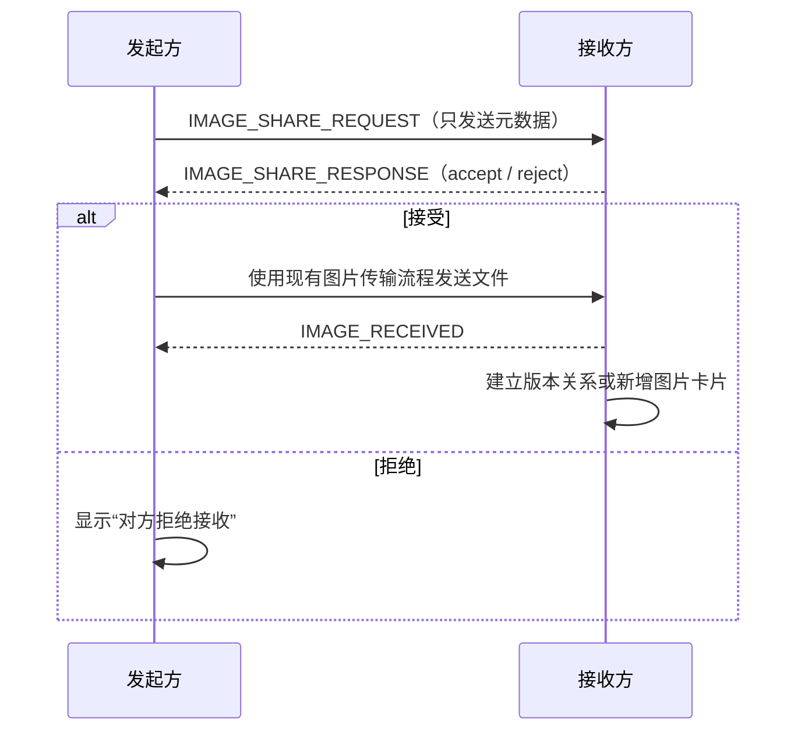

# PicBind Room v2.0 - Image Workspace 需求文档

## 1. 文档信息

| 项目 | 内容 |
| --- | --- |
| 版本 | v2.0 |
| 状态 | 需求草案 |
| 模块 | `sdk/room` |
| 产品目标 | 将 Room 从图片传输空间升级为实时图片处理协作工作台 |

本文描述 Image Workspace 的目标、核心对象、交互流程、协作协议和实施阶段。文中“当前能力”指仓库已经具备的能力；“v2.0 需求”均为后续需要实现并验收的能力。

## 2. 背景与问题

### 2.1 当前流程

```text
图片压缩 -> 选择图片 -> 进入 Room -> 发送图片
```

### 2.2 当前能力

- Room 支持图片选择、占位图、缩略图和原图传输。
- Room 支持 P2P、WebSocket 指令转发和 R2 文件中转。
- Gallery 支持图片预览、下载和进入 Review Workspace。
- Review 支持标注、评论、涂鸦和实时协作。
- Room 状态、消息和图片传输状态可在当前浏览器恢复。

### 2.3 主要问题

1. 图片进入 Room 后仍主要作为静态文件存在，没有统一的图片对象模型。
2. 图片处理结果与源图片之间缺少明确的版本关系。
3. 发送方和接收方无法围绕同一图片继续压缩、转换或生成新版本。
4. Review 中的绘制结果无法导出为新的图片版本。
5. 图片处理、协作确认、文件传输和结果分享缺少统一状态流。

## 3. 产品目标与范围

### 3.1 产品目标

Room 升级为 **Image Workspace**，提供以下能力：

- 图片对象管理
- 图片处理
- 图片版本管理
- 图片协作确认
- 处理结果分享
- Review 结果导出

### 3.2 v2.0 范围

| 能力 | v2.0 状态 |
| --- | --- |
| 图片对象化 | 必须实现 |
| 内容哈希 ID | 必须实现 |
| 图片操作菜单框架 | 必须实现 |
| 图片压缩 | 必须实现 |
| 压缩结果协作分享 | 必须实现 |
| 图片版本关系 | 必须实现 |
| Review 导出图片 | 必须实现 |
| 格式转换 | 仅展示入口，暂不可用 |
| 裁剪 | 仅展示入口，暂不可用 |
| 尺寸调整 | 仅展示入口，暂不可用 |
| 色彩调整 | 仅展示入口，暂不可用 |

## 4. 核心概念

### 4.1 Image Object

每张进入 Room 的图片都必须转换为一个 `ImageObject`。原图和每个处理结果都是独立对象，通过版本字段建立关系。

建议数据结构：

```ts
type ImageObject = {
  imageId: string;
  rootImageId: string;
  parentImageId: string | null;
  roomId: string;
  ownerId: string;
  name: string;
  mimeType: string;
  extension: string;
  size: number;
  width: number;
  height: number;
  source: "local" | "received" | "compressed" | "review-export";
  operation: "original" | "compress" | "convert" | "crop" | "resize" | "adjust" | "review-export";
  version: number;
  createdAt: number;
};
```

字段约束：

- `imageId`：当前文件二进制内容的唯一 ID。
- `rootImageId`：整条版本链的原始图片 ID。
- `parentImageId`：直接生成当前版本的上一个图片 ID；原图为 `null`。
- `ownerId`：创建当前版本的 Room 用户 ID。
- `version`：同一版本链内递增，不允许覆盖已有版本。

### 4.2 图片唯一 ID

v2.0 使用 Rust WASM 计算图片二进制的 MD5，结果作为 `imageId`：

```text
Image Binary -> Rust WASM -> MD5 -> imageId
```

要求：

- 相同二进制文件在不同设备上必须得到相同 `imageId`。
- 不同处理结果必须重新计算 `imageId`。
- MD5 仅用于内容标识和去重，不用于安全校验或身份认证。
- 发现相同 `imageId` 时不得重复保存同一份 Blob，但可以建立新的 Room 关联记录。

### 4.3 图片版本

所有处理操作都生成新版本，不覆盖原图：

```text
Original
  └── Compress
        └── Resize
              └── Adjust
```

版本列表至少展示：

- 版本号
- 操作类型
- 创建者
- 创建时间
- 文件格式和大小
- 相对上一个版本的体积变化

## 5. 存储边界

- Dexie / IndexedDB 只记录图片对象、版本关系、操作记录和 Room 关联数据。
- 原图、处理结果和导出图片的 Blob 必须存储在 OPFS，不得写入 Dexie。
- 临时预览 URL 使用完毕后必须调用 `URL.revokeObjectURL`。
- 页面卸载、任务取消或失败后必须释放临时 Blob、`ImageBitmap`、Worker 和 WASM 资源。
- Room 缓存恢复时先恢复元数据，再按需从 OPFS 读取 Blob，避免一次性加载所有图片。

## 6. Image Workspace UI

### 6.1 图片卡片

图片卡片至少展示：

- 文件名
- 文件大小
- 文件格式
- 当前版本
- 创建者或来源
- 传输状态

卡片右上角提供操作按钮。点击后展开扇形图片操作菜单：

- 压缩
- 格式转换
- 裁剪
- 尺寸调整
- 色彩调整

未实现的操作必须显示为禁用状态，并提供 Hover 提示，不得点击后进入空页面。

### 6.2 版本入口

- 存在多个版本时，卡片必须提供版本入口和版本数量。
- 用户切换版本后，预览、下载、Review 和后续操作都针对当前选中版本。
- 原图必须始终可访问，除非用户明确删除整条版本链。

## 7. 图片压缩

### 7.1 使用范围

- 发送方和接收方都可以压缩自己本地已拥有完整 Blob 的图片。
- 只有占位图或缩略图、尚未收到原图时，压缩入口不可用。
- 压缩任务在当前设备执行，不要求另一端在线。

### 7.2 操作流程

```text
图片操作菜单 -> 压缩 -> 选择输出格式 -> 开始压缩 -> 预览结果
```

压缩格式选项：

- 自动
- JPEG
- WebP
- AVIF

“自动”使用项目现有 Compression Predictor 和 Compression Planner 选择输出格式；显式选择格式时必须尊重用户选择。

### 7.3 压缩结果

结果面板至少展示：

- 原始格式和大小
- 输出格式和大小
- 减少的字节数和百分比
- 图片尺寸
- 预览按钮
- 分享到 Room 按钮

压缩成功后立即创建本地 `ImageObject` 和版本关系，但在对方接受之前不得自动发送文件。

## 8. 处理结果协作分享

### 8.1 分享流程



### 8.2 接收弹窗

接收方弹窗示例：

```text
A 基于 photo.jpg 生成了一张压缩图片。
WebP · 800 KB · 减少 84%

[拒绝] [接收]
```

### 8.3 接收结果

- 本地存在 `sourceImageId`：将新图片加入对应版本链。
- 本地不存在 `sourceImageId`：新增图片卡片，并保留收到的 `rootImageId`、`parentImageId` 信息。
- 接受后复用现有 P2P/R2 图片传输流程，不新增第二套二进制协议。
- 拒绝只拒绝本次分享，不删除发起方的本地版本。
- 传输取消、失败和重试继续复用现有图片传输状态。

### 8.4 分享状态

```text
local -> awaiting-response -> accepted -> transferring -> available
                          └-> rejected
                          └-> cancelled
                          └-> failed
```

## 9. Review 导出图片

### 9.1 Generate Image

Review Workspace 新增 `Generate Image` 按钮，用于将当前画布生成新的图片版本。

导出内容包含：

- 当前原图
- 当前可见绘制图层
- 图形、文字和 Emoji 标注

导出内容不包含：

- 锚点评论和评论状态
- 选择框、控制点和辅助线
- 用户光标
- 放大镜、激光笔、水波纹等临时演示效果
- 工具栏和其他 UI

### 9.2 导出结果

生成完成后打开 Preview Modal，展示：

- 导出图片预览
- 文件格式
- 文件大小
- 图片尺寸
- 保存到 Room
- 分享给对方
- 取消

确认保存后：

1. 生成新的 `ImageObject`，`operation` 为 `review-export`。
2. 新对象加入当前图片版本链。
3. 退出 Review，返回 Gallery 并定位到新版本。
4. 用户选择分享时，进入第 8 节的协作分享流程。

## 10. 协作消息协议

所有新增控制消息必须走指令通道；弱网时随其他指令同步切换到 WebSocket。图片二进制继续走文件通道或 R2。

### 10.1 v2.0 新增消息

| 消息 | 方向 | 用途 |
| --- | --- | --- |
| `IMAGE_SHARE_REQUEST` | 发起方 -> 接收方 | 请求分享一个本地处理结果，仅携带元数据 |
| `IMAGE_SHARE_RESPONSE` | 接收方 -> 发起方 | 接受或拒绝分享请求 |

建议载荷：

```ts
type ImageShareRequest = {
  type: "IMAGE_SHARE_REQUEST";
  payload: {
    requestId: string;
    sourceImageId: string;
    image: ImageObject;
  };
};

type ImageShareResponse = {
  type: "IMAGE_SHARE_RESPONSE";
  payload: {
    requestId: string;
    imageId: string;
    decision: "accept" | "reject";
  };
};
```

### 10.2 保留消息

`IMAGE_OPERATION_REQUEST` 和 `IMAGE_OPERATION_RESULT` 保留给未来“请求另一端执行图片操作”的能力，v2.0 不使用，避免与分享确认流程重复。

### 10.3 兼容要求

- 所有消息必须包含可去重的 `requestId`。
- 重复收到同一请求时不得重复弹窗或重复创建版本。
- 对方离线、离开房间或房间解散时，待确认请求必须进入失败或取消状态。
- 接受分享后使用现有 `IMAGE_START`、`IMAGE_COMPLETE`、`IMAGE_RECEIVED`、`IMAGE_CANCEL` 和 `IMAGE_FAILED` 等消息完成传输。

## 11. WASM 模块职责

v2.0 在共享 `sdk/wasm/image-wasm` 中补充以下能力：

- MD5 内容哈希
- 图片 metadata 提取
- Room 图片压缩调用所需的既有压缩能力

后续能力：

- Resize
- Crop
- Color Adjust

修改 Rust 或 WASM API 后必须重新生成 `sdk/wasm/image-wasm` 产物；如果改动同时影响压缩行为或公开压缩配置，还必须同步更新仓库根目录的 `COMPRESSION_ALGORITHM.md`。

## 12. 实施阶段与验收标准

### Phase 1：图片对象化

- 定义 `ImageObject` 和版本关系。
- Rust WASM 提供 MD5 和 metadata API。
- Gallery 现有图片迁移为对象模型。
- Dexie / IndexedDB 只保存元数据，Blob 保存到 OPFS。
- 刷新页面后可以恢复对象和版本关系。

### Phase 2：操作菜单框架

- 图片卡片提供统一操作入口。
- 压缩入口可用，其他未实现入口禁用。
- 操作面板组件化，不将逻辑继续堆入 `share-room-page.tsx`。

### Phase 3：压缩协作

- 双方均可对完整图片执行压缩。
- 压缩结果成为新版本且不覆盖原图。
- 分享前必须由接收方接受。
- 接受、拒绝、取消、失败和重试状态完整。
- 弱网下指令走 WebSocket，文件按现有规则走 P2P 或 R2。

### Phase 4：Review Export

- 可以将原图和可见绘制层合成为新图片。
- 评论、光标和临时演示效果不会被导出。
- 导出结果进入版本链，并可按标准流程分享。
- 导出失败不会破坏原图或已有 Review 历史。

## 13. 最终验收目标

PicBind Room 不再只是图片传输工具，而是一个支持图片对象管理、非破坏性处理、版本追踪、实时 Review 和处理结果分享的实时图片协作平台。
